# 庙算平台文档
## AI开发
### SDK运行环境

-   操作系统环境:
    -   Ubuntu = 20.04
-   Python解释器：
    -   python = 3.10

### SDK下载

下载地址为: [http://wargame.ia.ac.cn/aidevelopment](http://wargame.ia.ac.cn/aidevelopment)。选择社区开发板下载。

### SDK结构说明

下载后的zip文件内结构如下： 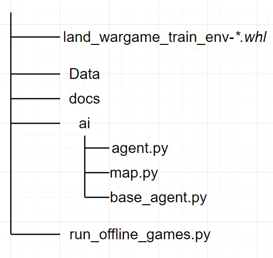
-   **land\_wargame\_train\_env-\*.whl**：SDK提供的环境安装包，用于安装核心模块
-   **Data**：包含SDK可用的地图，想定数据
-   **docs**：开发参考文档
-   **run\_offline\_games.py**：推演启动入口程序，提供了环境和AI的使用示例。开发者通过修改本文件代码，可以import自己开发的agent，自由设置对抗的次数，逻辑等。
-   **ai**：开发者需在SDK根目录下自己创建名为**ai**的Python package，并确保可以从此package中import到名为**Agent**的类，此类将在入口程序中被实例化来启动AI。公开的SDK已经为大家设置好正确的的结构，且在agent.py中内置了DemoAI。开发者可以参照公开的文件，类及结构，避免在在线上传AI时产生不必要的麻烦。
-   **ai/base\_agent.py**：陆战兵棋AI基类。开发人员在编写自己的AI时，必须继承base\_agent，并实现其中的抽象方法。
-   **ai/map.py**：为方便AI开发，SDK提供的地图相关基础函数工具（如寻路），供开发团队选用。
-   **ai/agent.py：**SDk中自带的DemoAI，此AI会下达随即动作。开发者可以参考也可以完全重写。

### SDK安装

解压zip文件，在解压后文件所在文件夹下使用以下命令安装SDK。修改install的whl文件名为真实文件名。SDK会自行安装并安装其依赖库。

```
<span></span><code>pip install land_wargame_train_env-*.whl</code>
```

随后对Data.zip文件进行原地解压：

### 测试安装

在终端执行以下命令。

```
<span></span><code>python run_offline_games.py</code>
```

终端应输出SDK版本号等其他信息并无报错，程序应该在1分钟内运行完毕，并生成复盘文件在<_project\_root>_/logs/replays\_。

## 环境使用
主要介绍下载的SDK中的兵棋环境在本地使用的方法和流程

### 环境本地使用流程
本地单机通过运行根目录下run_offline_games.py脚本启动引擎和本地Demo agent对抗。 agent生成动作后，env调用step接收双方的动作，并生成下一步的state以及done。state[RED]为红方态势，state[BLUE]是蓝方态势，state[GREEN]是包含了蓝方和红方的全局态势数据，在全局态势中，双方所有的算子信息全部可见。

在本地推演对战的实际过程中，开发人员对态势信息（state）和动作信息（actions）的内容和流动有完全的获取，修改，控制权；态势，数据和动作数据的具体格式参照态势数据说明以及动作。但是在线上网络对抗中，agent只能获得由对抗引擎发送的本方态势信息，env也只能接收到参加本次推演的agent产生的动作信息。
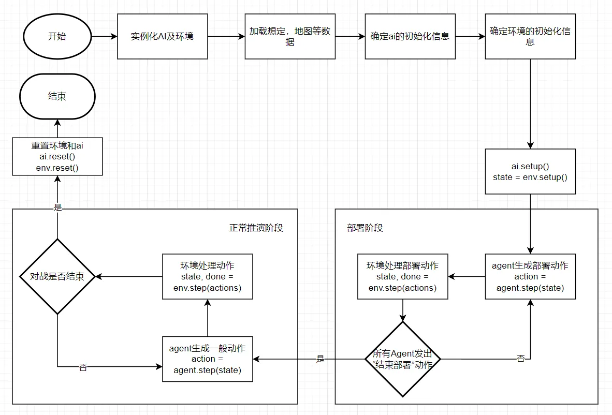

### 环境使用流程代码示例
在run_offline_game.py文件中运行以下代码：
```python
import time
from train_env import TrainEnv
from ai.agent import Agent # 开发者编写好的AI类

def main():
    """
    run demo in single agent mode
    """
    print("running in single agent mode...")
    # instantiate agents and env
    red1 = Agent()
    blue1 = Agent()
    env1 = TrainEnv()
    begin = time.time()

    # get data ready, data can from files, webs, or another source
    with open("data/scenarios/333.json") as f:
        scenario_data = json.load(f)
    with open("data/maps/333/333_basic.json") as f:
        basic_data = json.load(f)
    with open('data/maps/333/333_cost.pickle', 'rb') as file:
        cost_data = pickle.load(file)
    see_data = numpy.load("data/maps/333/333_see.npz")['data']

    # player setup info
    player_info = [{
        "seat": 1,
        "faction": 0,
        "role": 0,
        "user_name": "demo",
        "user_id": 0
    },
    {
        "seat": 11,
        "faction": 1,
        "role": 0,
        "user_name": "demo",
        "user_id": 0
    }]

    # env setup info
    env_step_info = {
        "scenario_data": scenario_data,
        "basic_data": basic_data,
        "cost_data": cost_data,
        "see_data": see_data,
        "player_info": player_info
    }

    # setup env
    state = env1.setup(env_step_info)
    print("Environment is ready.")

    # setup ai
    red1.setup(
        {
            "scenario": scenario_data,
            "basic_data": basic_data,
            "cost_data": cost_data,
            "see_data": see_data,
            "seat": 1,
            "faction": 0,
            "role": 0,
            "user_name": "demo",
            "user_id": 0,
            "state": state,
        }
    )
    blue1.setup(
        {
            "scenario": scenario_data,
            "basic_data": basic_data,
            "cost_data": cost_data,
            "see_data": see_data,
            "seat": 11,
            "faction": 1,
            "role": 0,
            "user_name": "demo",
            "user_id": 0,
            "state": state,
        }
    )
    print("agents are ready.")

    # loop until the end of game
    print("steping")
    done = False
    while not done:
        actions = []
        actions += red1.step(state[RED])
        actions += blue1.step(state[BLUE])
        state, done = env1.step(actions)
        all_states.append(state[GREEN])

    env1.reset()
    red1.reset()
    blue1.reset()

    print(f"Total time: {time.time() - begin:.3f}s")


if __name__ == "__main__":
    main()

```

### 关于单/多agent模式的说明
#### 单agent模式
单agent模式指的是，一局游戏中，单方阵营内只有1个agent实例。此agent实例拥有操作本方阵营所有算子的权利。并且不会和其他agent发生信息交互。 此模式下的通常对抗场景有：

- 1 × 人类队长 vs. 1 × agent
- 1 × 人类队长 + i × 人类队员 vs. 1 × agent
通常情况下0 <= i <= 4

####多agent模式
多agent模式指的是，在一局游戏中，任一方中有多个agent实例构成，比如一方阵营中1个队长，2个人类队员，和2个agent队员。 队长可以下达更多的动作，包括兵力编组，下达战斗任务等队长专属动作；而队员只可以下达一般动作。

每个agent和人类只控制部分算子，并接收队长下达的任务。 在此模式下，agent实例之间存在潜在的信息上的交互。

此模式的通常对战用例有：

- 1 × 人类队长 + i × 人类队员 + j × agent vs. 1 × 人类队长 + m × 人类队员 + n × agent
通常情况下0 <= j, n <= 5，0 <= j+n <= 5

#### 单agent模式下的环境使用流程代码示例
在/run_offline_game.py文件中运行以下代码：
```python
import time
from train_env import TrainEnv
from ai1.agent import Agent as LianAgent
from ai2.agent import Agent as YingAgent


def main():
    """
    run demo in single agent mode
    """
    print("running in single agent mode...")
    # instantiate agents and env

# 多agent模式下的环境使用流程代码示例
在/run_offline_game.py文件中运行以下代码：
```python linenums="1"
import time
from train_env import TrainEnv
from ai1.agent import Agent as LianAgent
from ai2.agent import Agent as YingAgent


def main():
    """
    run demo in multi agent mode
    """
    print("running in multi agent mode...")
    # instantiate agents and env
    red1 = LianAgent()
    red2 = YingAgent()
    red3 = YingAgent()
    blue1 = LianAgent()
    blue2 = YingAgent()
    blue3 = YingAgent()
    env1 = TrainEnv()
    begin = time.time()

    # get data ready, data can from files, web, or any other sources
    with open("data/scenarios/333.json") as f:
        scenario_data = json.load(f)
    with open("data/maps/333/333_basic.json") as f:
        basic_data = json.load(f)
    with open('data/maps/333/333_cost.pickle', 'rb') as file:
        cost_data = pickle.load(file)
    see_data = numpy.load("data/maps/333/333_see.npz")['data']

    # player setup info
    player_info = [{
        "seat": 1,
        "faction": 0,
        "role": 1,
        "user_name": "red1",
        "user_id": 1
    },
    {
        "seat": 2,
        "faction": 0,
        "role": 0,
        "user_name": "red2",
        "user_id": 2
    },
    {
        "seat": 3,
        "faction": 0,
        "role": 0,
        "user_name": "red3",
        "user_id": 3
    },
    {
        "seat": 11,
        "faction": 1,
        "role": 1,
        "user_name": "blue1",
        "user_id": 11
    },
    {
        "seat": 12,
        "faction": 1,
        "role": 0,
        "user_name": "blue2",
        "user_id": 12
    },
    {
        "seat": 13,
        "faction": 1,
        "role": 0,
        "user_name": "blue3",
        "user_id": 13
    }]

    # env setup info
    env_step_info = {
        "scenario_data": scenario_data,
        "basic_data": basic_data,
        "cost_data": cost_data,
        "see_data": see_data,
        "player_info": player_info
    }

    # setup env
    state = env1.setup(env_step_info)
    all_states.append(state[GREEN])
    print("Environment is ready.")

    # setup AIs
    red1.setup(
        {
            "scenario": scenario_data,
            "basic_data": basic_data,
            "cost_data": cost_data,
            "see_data": see_data,
            "seat": 1,
            "faction": 0,
            "role": 1,
            "user_name": "red1",
            "user_id": 1,
            "state": state,
        }
    )
    red2.setup(
        {
            "scenario": scenario_data,
            "basic_data": basic_data,
            "cost_data": cost_data,
            "see_data": see_data,
            "seat": 2,
            "faction": 0,
            "role": 0,
            "user_name": "red2",
            "user_id": 2,
            "state": state,
        }
    )
    red3.setup(
        {
            "scenario": scenario_data,
            "basic_data": basic_data,
            "cost_data": cost_data,
            "see_data": see_data,
            "seat": 3,
            "faction": 0,
            "role": 0,
            "user_name": "red3",
            "user_id": 3,
            "state": state,
        }
    )
    blue1.setup(
        {
            "scenario": scenario_data,
            "basic_data": basic_data,
            "cost_data": cost_data,
            "see_data": see_data,
            "seat": 11,
            "faction": 1,
            "role": 1,
            "user_name": "blue1",
            "user_id": 11,
            "state": state,
        }
    )
    blue2.setup(
        {
            "scenario": scenario_data,
            "basic_data": basic_data,
            "cost_data": cost_data,
            "see_data": see_data,
            "seat": 12,
            "faction": 1,
            "role": 0,
            "user_name": "blue2",
            "user_id": 12,
            "state": state,
        }
    )
    blue3.setup(
        {
            "scenario": scenario_data,
            "basic_data": basic_data,
            "cost_data": cost_data,
            "see_data": see_data,
            "seat": 13,
            "faction": 1,
            "role": 0,
            "user_name": "blue3",
            "user_id": 13,
            "state": state,
        }
    )
    print("agents are ready.")

    # loop until the end of game
    print("steping")
    done = False
    while not done:
        actions = []
        actions += red1.step(state[RED])
        actions += red2.step(state[RED])
        actions += red3.step(state[RED])
        actions += blue1.step(state[BLUE])
        actions += blue2.step(state[BLUE])
        actions += blue3.step(state[BLUE])
        state, done = env1.step(actions)
        all_states.append(state[GREEN])

    env1.reset()
    red1.reset()
    red2.reset()
    red3.reset()
    blue1.reset()
    blue2.reset()
    blue3.reset()

    print(f"Total time: {time.time() - begin:.3f}s")

if __name__ == "__main__":
    main()
```

## 环境接口

### **AI本地开发**

AI开发需要自行编写名为`Agent`的类，继承`BaseAgent`类并重载一些方法:

-   [setup](https://wargame.ia.ac.cn/docs/reference/apis/#baseagentsetup)
-   [step](https://wargame.ia.ac.cn/docs/reference/apis/#baseagentstep)
-   [reset](https://wargame.ia.ac.cn/docs/reference/apis/#baseagentreset)

这些方法均来自BaseAgent类

### **BaseAgent类接口**

`BaseAgent`类包含3个抽象方法，[setup](https://wargame.ia.ac.cn/docs/reference/apis/#baseagentsetup)、[step](https://wargame.ia.ac.cn/docs/reference/apis/#baseagentstep)，[reset](https://wargame.ia.ac.cn/docs/reference/apis/#baseagentreset)。这些方法为AI必须编写的方法，未实现这些方法的agent将无法使用本SDK进行开发和线上接入。

#### **`BaseAgent.setup`**

**功能：**在推演开始之前，向agent提供此次推演的相关配置信息，agent应在此函数中进行一些初始化等操作。此方法只接收一个参数`setup_info`；此参数为一个字典，字典内包含关于当前推演的一些开局信息。以下字典内参数均为在正式网络对抗时，在线对抗引擎一定会向此接口提供的参数，单机离线时完全由开发者自行决定是否提供。

**参数说明：**
|参数名|	数据类型|	说明|
|--|--|--|
|setup_info|	dict|	此场对局相关的详细配置信息|
|setup_info["scenario"]|	dict|	想定数据|
|setup_info["basic_data"]|	dict|	地图基础数据|
|setup_info["cost_data"]|	dict|	地图通行成本数据|
|setup_info["see_data"]|	dict|	地图通视数据|
|setup_info["seat"]|	int|	本场对局的席位数，用来区分智能体的唯一值|
|setup_info["faction"]|	int|	阵营id，0为红，1为蓝|
|setup_info["role"]|	int|	角色，0为连长，1为营长|
|setup_info["user_name"]|	string|	用户名|
|setup_info["user_id"]|	int|	用户id|
|setup_info["state"]|	dict|	完整初始态势（第一帧），包括红蓝绿三方的完整观测数据|
**返回值：**无

**示例：（来自DemoAI）** 在agent实例化时，通过setup告诉agent关于此场特定的推演的一些信息。setup在每场推演前都要调用一次。agent在此时可以主动加载，处理这场对局将要用的数据，保存一些参数等必要操作。

```python
def setup(self, setup_info: dict):
    self.scenario = setup_info["scenario"]
    self.color = setup_info["faction"]
    self.faction = setup_info["faction"]
    self.seat = setup_info["seat"]
    self.role = setup_info["role"]
    self.user_name = setup_info["user_name"]
    self.user_id = setup_info["user_id"]
    self.priority = {
        ActionType.Occupy: self.gen_occupy,
        ActionType.Shoot: self.gen_shoot,
        ActionType.GuideShoot: self.gen_guide_shoot,
        ActionType.JMPlan: self.gen_jm_plan,
        ActionType.LayMine: self.gen_lay_mine,
        ActionType.ActivateRadar: self.gen_activate_radar,
        ActionType.ChangeAltitude: self.gen_change_altitude,
        ActionType.GetOn: self.gen_get_on,
        ActionType.GetOff: self.gen_get_off,
        ActionType.Fork: self.gen_fork,
        ActionType.Union: self.gen_union,
        ActionType.EnterFort: self.gen_enter_fort,
        ActionType.ExitFort: self.gen_exit_fort,
        ActionType.Move: self.gen_move,
        ActionType.RemoveKeep: self.gen_remove_keep,
        ActionType.ChangeState: self.gen_change_state,
        ActionType.StopMove: self.gen_stop_move,
        ActionType.WeaponLock: self.gen_WeaponLock,
        ActionType.WeaponUnFold: self.gen_WeaponUnFold,
        ActionType.CancelJMPlan: self.gen_cancel_JM_plan
    }  # choose action by priority
    self.observation = None
    self.map = Map(
        setup_info["basic_data"],
        setup_info["cost_data"],
        setup_info["see_data"]
    )  # use 'Map' class as a tool
    self.map_data = self.map.get_map_data()</code>
```

#### **`BaseAgent.step`**

**功能：**agent在对局过程中需要调用`step`接收态势以及输出agent动作列表。以下参数均为在正式网络对抗时，引擎一定会向此接口提供的参数，单机离线时完全由开发者自行决定是否提供。

**参数说明：**
|参数名|	数据类型|	说明|
|--|--|--|
|observation|	dict|	[态势数据(https://wargame.ia.ac.cn/docs/reference/observations/)]|
**返回值：**
|数据类型|	说明|
|--|--|
|List[dict]|	agent返回生成的符合格式要求的动作列表。详见[动作数据(https://wargame.ia.ac.cn/docs/reference/actions/)]|

**示例：（来自DemoAI）** 在`BaseAgent.step`中开发者需要体现AI的策略。`BaseAgent.step`函数传入的参数是态势信息,输出的则是agent的动作列表。因为agent所作出的一切动作都必须要通过step函数来返回，所以开发者需要在`BaseAgent.step`函数中完成接受态势以及生成动作的功能。态势数据和动作数据见[态势数据](https://wargame.ia.ac.cn/docs/reference/observations/)以及[动作数据](https://wargame.ia.ac.cn/docs/reference/actions/)。

```python
def step(self, observation: dict):
    self.observation = observation  # save observation for later use
    self.team_info = observation["role_and_grouping_info"]
    self.controllable_ops = observation["role_and_grouping_info"][self.seat][
        "operators"
    ]
    communications = observation["communication"]
    for command in communications:
        if command["type"] in [200, 201] and command["info"]["company_id"] == self.seat:
            if command["type"] == 200:
                self.my_mission = command
            elif command["type"] == 201:
                self.my_direction = command
    total_actions = []

    if observation["time"]["stage"] == 1:
        actions = []
        for item in observation["operators"]:
            if item["obj_id"] in self.controllable_ops:
                operator = item
                if operator["sub_type"] == 2 or operator["sub_type"] == 4:
                    actions.append(
                        {
                            "actor": self.seat,
                            "obj_id": operator["obj_id"],
                            "type": 303,
                            "target_obj_id": operator["launcher"],
                        }
                    )
        actions.append({
            "actor": self.seat,
            "type": 333
        })
        return actions

    # loop all bops and their valid actions
    for obj_id, valid_actions in observation["valid_actions"].items():
        if obj_id not in self.controllable_ops:
            continue
        for (
            action_type
        ) in self.priority:  # 'dict' is order-preserving since Python 3.6
            if action_type not in valid_actions:
                continue
            # find the action generation method based on type
            gen_action = self.priority[action_type]
            action = gen_action(obj_id, valid_actions[action_type])
            if action:
                total_actions.append(action)
                break  # one action per bop at a time
    return total_actions</code>
```

#### **`BaseAgent.reset`**

**功能：**在一场推演结束后，agent需要调用`reset`清空AI在对局中调用的数据、模型、资源等。

**参数说明：**无

**返回值：**无

**示例：（来自DemoAI）** agent每场对局结束后执行一次`reset`函数。`reset`函数没有参数和返回值，仅用于赛后释放agent在策略中用到的数据、模型等外部信息。选手需要在`reset`函数中清空自己在对局中生成的数据等外部信息，以避免数据未清空的情况下导致这些数据对接下来的对局过程中agent的决策产生意外的影响。

```python
def reset(self):
    self.scenario = None
    self.color = None
    self.priority = None
    self.observation = None
    self.map = None
    self.scenario_info = None
    self.map_data = None
    self.seat = None
    self.faction = None
    self.role = None
    self.controllable_ops = None
    self.team_info = None
    self.my_direction = None
    self.my_mission = None
    self.user_name = None
    self.user_id = None
    self.history = None</code>
```

### **TrainEnv类接口**

#### **`TrainEnv.__init__`**

**功能：**构建环境实例

**参数说明**：无

**返回值**：环境实例

#### **`TrainEnv.setup`**

**功能：**配置环境，输入此次推演环境所需的所有配置信息，并初始化环境后返回第一帧的完整红蓝绿态势。

**参数说明：**
| 参数名 | 数据类型 | 说明 |
|--------|----------|------|
| setup_info | dict | 整个方法的参数 dict 合集 |
| setup_info['scenario_data'] | dict | 想定数据 |
| setup_info['basic_data'] | dict | 地图基础数据 |
| setup_info['cost_data'] | dict | 地图通行成本数据 |
| setup_info['see_data'] | dict or None | 地图通视数据，SDK 自 5.0.0 版本起，see_data 可为 None |
| setup_info['player_info'] | list | 推演席位信息。player_info 是一个 list[dict]，结构如下 |
| setup_info['player_info'][*]['seat'] | int | 代表 player 的席位 |
| setup_info['player_info'][*]['faction'] | int | 代表 player 阵营 |
| setup_info['player_info'][*]['role'] | int | 代表 player 的角色 |
| setup_info['player_info'][*]['user_name'] | int | 用户名 |
| setup_info['player_info'][*]['user_id'] | int | 用户 id |

**返回值：** 返回游戏完整第一帧完整红蓝绿态势字典，详见[态势数据](https://wargame.ia.ac.cn/docs/reference/observations/)

#### **`TrainEnv.step`**

**功能：**接受各类动作，包括机动，打击，部署上车，兵力部署等，处理所有动作后返回新的一帧完整态势，以及是否达到游戏结束条件的flag。详见[动作数据](https://wargame.ia.ac.cn/docs/reference/actions/)和[态势数据](https://wargame.ia.ac.cn/docs/reference/observations/)。

**参数说明：**
| 参数名 | 数据类型 | 说明 |
|--------|----------|------|
| action_msgs | list[dict] | 动作列表, 详见[动作数据](https://wargame.ia.ac.cn/docs/reference/actions/) |
**返回值：** 返回游戏完整态势字典，返回游戏是否结束的boolean
|返回变量名|	数据类型|	说明|
|--------|----------|------|
state	list[dict]	态势列表，其中state[0]代表红方态势，state[1]代表蓝方态势， state[-1]代表绿方态势，详见[态势数据](https://wargame.ia.ac.cn/docs/reference/observations/)
done	bool	推演是否到达结束条件
#### **`TrainEnv.reset`**

**功能**：重置环境，重置子模块，清空环境中的变量，释放环境占用的资源

**参数说明**：无

**返回值**：无

## 态势

### **状态与态势**

**State and Observation**

`state`一般代表环境当前的所有状态。`observation`一般情况下代表对于某个智能体可观测的态势。`observation`是`state`的子集。

`TrainEnv`的`step`函数返回的`state`，表示当前环境的所有状态合集。状态合集有红方蓝方绿方态势组成：`state[0]`代表的是红方态势，`state[1]`代表的是蓝方态势,`state[-1]`代表的是绿方态势。 agent代码的`step`函数接受的参数是态势`observation`，它封装了当前时间，此agent能观测到的所有盘面信息，包括算子信息、裁决信息等。以下是态势最外层的数据结构以及他们代表的含义。
|Field|	Type|	Description|
|--------|----------|------|
|actions|	list|	上一步接收到的动作|
|cities|	list|	各个夺控点的信息|
|communication|	list|	通信相关信息|
|jm_points|	list|	间瞄点信息|
|judge_info|	list|	裁决信息|
|landmarks|	dict|	地标信息，雷场，路障|
|operators|	list|	算子信息|
|passengers|	list|	乘员信息|
|role_and_grouping_info|	dict|	玩家信息和编组信息|
|scenario_id|	int|	想定ID|
|scores|	dict|	分数信息|
|terrain_id|	int|	地图 ID|
|time|	dict|	时间信息|
|valid_actions|	dict|	当前态势下的可做动作信息|
|extra|	dict|	额外信息|
### **算子属性**

**`observation["operators"]`和`observation["passengers"]`**

Note

注：`passengers`为车上乘员算子属性，其字段与`operators`字段完全一致
| Field | Type | Description |
|-------|------|------------- |
| obj_id | int | 算子ID |
| color | int | 算子阵营 0-红 1-蓝 |
| type | int | 算子类型 1-步兵 2-车辆 3-飞机 4-工事 5-战略支援算子 |
| name | str | 名称 |
| sub_type | int | 细分类型（如坦克、无人机等，详见枚举说明） |
| basic_speed | int | 基础速度 km/h |
| armor | int | 装甲类型 0-无 1-轻型 2-中型 3-重型 4-复合装甲 |
| A1 | int | 是否有行进间射击能力 |
| stack | int | 是否堆叠 |
| carry_weapon_ids | list[int] | 携带武器ID |
| remain_bullet_nums | dict[int, int] | 剩余弹药数（按类型分类） |
| remain_bullet_nums_bk | dict[int, int] | 敌方看到的弹药数 |
| guide_ability | int | 是否有引导射击能力 |
| value | int | 分值 |
| valid_passenger_types | list[int] | 可承载的乘员 sub_type |
| max_passenger_nums | dict[int, int] | 最大承载数 |
| loading_capacity | int | 最大承载车班数 |
| observe_distance | list[int] | 对不同 sub_type 的观察距离 |
| move_state | int | 机动状态（0-正常 1-行军 等） |
| cur_hex | int | 当前坐标（四位数） |
| cur_pos | float | 当前格到下一格的百分比进度 |
| speed | int | 当前机动速度 格/s |
| move_to_stop_remain_time | int | 机动转停止的剩余时间 |
| can_to_move | int | 是否可继续机动（停止转换中） |
| flag_force_stop | int | 是否被强制停止 |
| stop | int | 是否静止 |
| move_path | list[int] | 计划机动路径 |
| blood | int | 当前血量 |
| max_blood | int | 最大血量 |
| tire | int | 疲劳等级（0-不疲劳，1-一级，2-二级） |
| tire_accumulate_time | int | 累积疲劳时间 |
| keep | int | 是否被压制 |
| keep_remain_time | int | 压制剩余时间 |
| on_board | int | 是否在车上 |
| car | int | 所属车辆ID |
| launcher | int | 所属发射器ID（下车/发射后） |
| passenger_ids | list[int] | 乘客ID列表 |
| launch_ids | list[int] | 发射单元ID列表 |
| lose_control | int | 是否失去控制（如无人车） |
| alive_remain_time | int | 巡飞弹剩余存活时间 |
| get_on_remain_time | float | 上车剩余时间 |
| get_on_partner_id | list[int] | 上车相关ID（车与乘员） |
| get_off_remain_time | int | 下车剩余时间 |
| get_off_partner_id | list[int] | 下车相关ID |
| change_state_remain_time | int | 状态切换剩余时间 |
| target_state | int | 状态转换目标状态 |
| weapon_cool_time | int | 武器冷却剩余时间 |
| weapon_unfold_time | int | 武器展开/锁定剩余时间 |
| weapon_unfold_state | int | 武器状态（0-锁定，1-展开） |
| see_enemy_bop_ids | list[int] | 可见敌方算子ID列表 |
| owner | int / str | 所属玩家席位ID |
| close_combat | int | 是否在同格交战中 |
| stationary_count | int | 静止步长 |
| forking | int | 是否在解聚 |
| forking_remain_time | int | 解聚剩余时间 |
| unioning | int | 是否在聚合 |
| unioning_remain_time | int | 聚合剩余时间 |
| unioning_partner | int | 聚合对象ID |
| unioining_role | int | 聚合角色（1-发起者，2-被动者） |
| altitude | int | 当前高度 |
| changing_altitude | int | 是否在改变高度 |
| changing_altitude_remain_time | int | 改变高度剩余时间 |
| target_altitude | int | 目标高度 |
| activating_radar | int | 是否开启雷达 |
| activating_radar_remain_time | int | 开启雷达剩余时间 |
| radar_activated | int | 雷达是否开启 |
| in_fort | int | 是否在工事中 |
| fort | int | 所在工事ID |
| entering_fort | int | 是否正在进入工事 |
| entering_fort_remain_time | int | 进入工事剩余时间 |
| entering_fort_partner | list[int] | 进入工事相关对象ID |
| exiting_fort | int | 是否在离开工事 |
| exiting_fort_remain_time | int | 离开工事剩余时间 |
| exiting_fort_partner | list[int] | 离开工事相关对象ID |
| fort_passengers | list[int] | 工事中的算子ID |
| laying_mine | int | 是否正在布雷 |
| laying_mine_remain_time | int | 布雷剩余时间 |
| remaining_mine_count | int | 剩余雷场数 |
| laying_mine_target_pos | int | 当前布雷目标格 |
| observalbe_distance | int | 可被观察的基础距离 |
| disrupt_cooldown | int | 干扰冷却时间 |
| disrupt_duration | int | 干扰持续时间 |
| disrupt_direction | int | 干扰方向（六个方向之一） |
| disrupt_ongoing | boolean | 是否正在进行电子干扰 |
| disrupted | boolean | 是否被电子干扰 |
| disrupted__globally | boolean | 是否被全局电子干扰 |
| warhead_loaded | boolean | 是否装弹 |
| disguised | boolean | 是否伪装下 |
| disguising | boolean | 是否正在伪装 |
| disguising_remain_time | int | 伪装剩余时间 |
| launching | boolean | 是否正在发射 |
| launching_remain_time | boolean | 发射剩余时间 |
| launched | boolean | 是否完成发射 |
| jam_counter_cooldown_remain_time | boolean | 抗干扰剩余时间 |
| roadblock_building_capability | boolean | 设障能力指示 |
| roadblock_building | boolean | 是否正在设障 |
| roadblock_building_remain_time | int | 设障剩余时间 |
| roadblock_building_remain_number | int | 设障剩余次数 |
| roadblock_clearing_capability | boolean | 清障能力指示 |
| roadblock_clearing | boolean | 是否正在清障 |
| roadblock_clearing_remain_time | int | 清障剩余时间 |
| comnode_sabotaging_capability | boolean | 破坏通信节点能力指示 |
| comnode_sabotaging_remain_number | int | 破坏通信节点剩余次数 |
| comnode_repairing_capability | boolean | 维修破坏节点能力指示 |
### **时间**

**`observation["time"]`**

```json
{
    "cur_step": "int, 当前步长",
    "tick": "int, 每次step会前进多少帧",
    "max_time": "int, 最大帧数",
    "max_step": "int, 最大步数，等于max_time/tick",
    "stage": "int, 当前处于的阶段，0-环境配置阶段，1-部署阶段，2-正常推进阶段"
}
```

### **间瞄点信息**

**`observation["jm_points"]`**

态势信息中包含己方的正在飞行的和正在爆炸的间瞄点信息，以及敌方正在爆炸的间瞄点信息，敌方正在飞行的间瞄点信息无法得到。
|Field Name|	Description|	Data Type|
|--|--|--|
|obj_id|	攻击算子ID|	int|
|color|	炮弹所属方|	int|
|weapon_id|	攻击武器ID|	int|
|pos|	位置|	int|
|status|	当前状态: 0-正在飞行 (Flying); 1-正在爆炸 (Exploding); 2-无效 (Invalid)  |	int|
|fly_time|	已飞行时间|	int|
|boom_time|	已爆炸时间|	int|
|align_status|	校射状态|	int|
|flag_offset|	是否偏移|	bool|
|off_field|	是否为场外火力支援|	bool|
|x_or_y|	火力支援类型|	str|
### **夺控点信息**

**`observation["cities"]`**

```json
[
    {
        "coord": "int, 坐标",
        "value": "int, 分值",
        "flag": "int, 阵营 0-红 1-蓝",
        "name": "str, 名称 str"
    }
]
```

### **对局分数信息**

**`observation["scores"]`**
|Field Name|	Description|	Data Type|
|--|--|--|
|red_attack|	红方战斗得分|	int|
|red_occupy|	红方夺控分|	int|
|red_remain|	红方剩余算子分|	int|
|red_reamin_max|	红方最大剩余得分|	int|
|red_mission|	红方任务分|	int|
|red_total|	红方总分|	int|
|red_win|	红方净胜分|	int|
|blue_attack|	蓝方攻击得分|	int|
|blue_occupy|	蓝方夺控分|	int|
|blue_remain|	蓝方剩余得分|	int|
|blue_reamin_max|	蓝方最大剩余得分|	int|
|blue_mission|	蓝方任务分|	int|
|blue_total|	蓝方总分|	int|
|blue_win|	蓝方净胜分|	int|
### **裁决信息**

**`observation["judge_info"]`**

共有四种裁决信息：直瞄射击，间瞄射击，引导射击，雷场裁决

```json
[
  # 直瞄射击类型
  {
    "att_level": "int, 攻击等级  ",
    "att_obj_blood": "int, 攻击算子血量",
    "att_obj_id": "int, 攻击算子ID",
    "attack_color": "int, 攻击算子颜色",
    "attack_sub_type": "int, 攻击算子类型",
    "cur_step": "int, 当前步长",
    "damage": "int, 最终战损",
    "distance": "int, 距离",
    "ele_diff": "int, 高差等级",
    "ori_damage": "int, 原始战损",
    "random1": "int, 随机数1",
    "random2": "int, 随机数2",
    "random2_rect": "int, 随机数2修正值",
    "rect_damage": "int, 战损修正值",
    "target_color": "int, 目标颜色",
    "target_obj_id": "int, 目标id",
    "target_sub_type": "int, 目标类型",
    "type": "str, 直瞄射击",
    "wp_id": "int, 武器ID int"
    },
  # 间瞄射击类型
  {
    "align_status": "int, 较射类型 0-无较射 1-格内较射 2-目标较射",
    "att_obj_blood": "int, 攻击算子血量",
    "att_obj_id": "int, 攻击算子ID",
    "attack_color": "int, 攻击算子颜色",
    "attack_sub_type": "int, 攻击算子类型",
    "cur_step": "int, 当前步长",
    "damage": "int, 最终战损",
    "distance": "int, 距离",
    "ori_damage": "int, 原始战损",
    "ori_random2": "int, ",
    "offset": "bool, 偏移 bool",
    "random1": "int, 随机数1",
    "random2": "int, 随机数2",
    "random2_rect": "int, 随机数2修正值",
    "rect_damage": "int, 战损修正值",
    "target_color": "int, 目标颜色",
    "target_obj_id": "int, 目标id",
    "target_sub_type": "int, 目标类型",
    "type": "str, 间瞄射击",
        "wp_id": "int, 武器ID"
  },
  # 引导射击类型
    {
    "att_level": "int, 攻击等级",
    "att_obj_blood": "int, 攻击算子血量",
    "att_obj_id": "int, 攻击算子ID",
    "attack_color": "int, 攻击算子颜色",
    "attack_sub_type": "int, 攻击算子类型",
    "cur_step": "int, 当前步长",
    "damage": "int, 最终战损",
    "distance": "int, 距离",
    "ele_diff": "int, 高差等级",
    "guide_obj_id": "int, 引导算子ID",
    "ori_damage": "int, 原始战损",
    "random1": "int, 随机数1",
    "random2": "int, 随机数2",
    "random2_rect": "int, 随机数2修正值",
    "rect_damage": "int, 战损修正值",
    "target_color": "int, 目标颜色",
    "target_obj_id": "int, 目标id",
    "target_sub_type": "int, 目标类型",
    "type": "str, 引导射击",
    "wp_id": "int, 武器ID",
  },
  # 雷场射击类型
  {
    "target_obj_id": "int, 目标算子id",
    "target_color": "int, 目标颜色",
    "target_type": "int, 目标类型",
    "target_armor": "int, 目标护甲",
    "original_damage_random_number": "int, 原始战损随机数",
    "calibration_random_number": "int, 修正随机数",
    "calibration_value": "int, 修正值",
    "final_damage": "int, 最终战损",
    "cur_step": "int, 当前步数",
    "minefield_id": "int, 雷场id",
    "minefield_hex": "int, 雷场位置",
    "minefield_color": "int, 雷场颜色",
    "type": "str, 雷场裁决"
  }
]</code>
```

### **编组角色信息**

**`observation["role_and_grouping_info"]`**

`key`为席位`value`为席位对应的玩家的角色和编组信息

```json
{
    0: {
        "faction": "int 红为0，蓝为1",
        "role": "int 分队为0，群队为1",
        "operators": "list[int],拥有的算子id",
        "user_id": "int",
        "user_name": "str"
    },
    1: {
        "faction": "int, 红为0，蓝为1",
        "role": "int, 分队为0，群队为1",
        "operators": "list[int], 拥有的算子id",
        "user_id": "int",
        "user_name": "str"
    },
    ...
}</code>
```

### **通信信息**

**`observation["communication"]`**

包含了本方阵营当前的战斗任务信息等通信信息,由队长发出

```json
[
    # 进攻任务信息
    {
        "actor": "int 动作发出者席位",
        "type": 207,
        "seat": "命令接收人id",
        "hex": "任务目标位置",
        "start_time": "起始时间",
        "end_time": "结束时间",
        "unit_ids": "执行任务的单位ID列表",
        "route": "执行此任务的途径点列表"
    },
    # 防御任务
    {
        "actor": "int 动作发出者席位",
        "type": 208,
        "seat": "命令接收人id",
        "hex": "任务目标位置",
        "start_time": "起始时间",
        "end_time": "结束时间",
        "unit_ids": "执行任务的单位ID列表",
        "route": "执行此任务的途径点列表"
    },
    # 侦察任务
    {
        "actor": "int 动作发出者席位",
        "type": 209,
        "seat": "命令接收人id",
        "hex": "任务目标位置",
        "radius": "侦察半径",
        "start_time": "起始时间",
        "end_time": "结束时间",
        "unit_ids": "执行任务的单位ID列表",
        "route": "执行此任务的途径点列表"
    },
    # 集结任务
    {
        "actor": "int 动作发出者席位",
        "type": 210,
        "seat": "命令接收人id",
        "hex": "任务目标位置",
        "start_time": "起始时间",
        "end_time": "结束时间",
        "unit_ids": "执行任务的单位ID列表",
        "route": "执行此任务的途径点列表"
    },
    # 聊天信息
    {
        "actor": "int, 本方营长的席位id",
        "type": "int, 204",
        "receive_step": "int, 接收时的步数",
        "to_all": "int, 0-对队友发出，1-对所有人发出",
        "msg_body": "str",
        "msg_id": "int, 此消息的id"
    },
    # 渲染信息
    {
        "actor": "int 动作放出者",
        "type": "int, 205",
        "msg_id": "int, 此消息的id",
        "receive_step": "int, 接收时的步数",
        "to_all": "int, 0-对队友发出，1-对所有人发出",
        "msg_body": {
            "hexs": "list[int], 要渲染的六角格坐标", 
            "graphic_type": "str, 渲染类型",
            "word": "str, 渲染字符",
            "color": "str, 颜色",
            "description": "str, 对于此命令的其他描述"
        } 
    },
    # 发射任务
    {
        "actor": "int 动作放出者",
        "type": "int, 334",
        "msg_id": "int, 此消息的id",
        "receive_step": "int, 接收时的步数",
        "start_time": "int, 任务起始时间",
        "end_time": "int， 任务结束时间",
        "launch_sites": "list[int] 发射地点列表"
    },
]</code>
```

### **地标信息**

**`observation["landmarks"]`**

包含一局推演中的地标信息，比如路障，雷场的信息

```json
"landmarks": {
    "roadblocks": "list[int], 六角格坐标",
    "minefields": [
        {
            "id": "int, 雷场id",
            "name": "str, 雷场",
            "hex": "int, 位置",
            "color": "int, 颜色",
            "creator": "int/None, 雷场创造者，None-想定自带雷场，int-算子创造雷场",
            "roads": [
            {
                "id": "int, 通路id",
                "creator": "int, 通路制造者，int-制造通路的算子id",
                "direction": "int, 通路方向，0~5，0是正右侧，按逆时针递进",
                "color": "int, 通路颜色",
                "hex": "int, 通路位置"
            }
            ]
        }
    ]
}</code>
```

### **地图id**

**`observation["terrain_id"]`**

包含此次推演使用的地图id
```json
"terrain_id": "int"
```
### **想定id**

**`observation["想定id“scenario_id”"]`**

包含此次推演使用的想定的id
```json
"scenario_id": "int"
```
### **合法动作**

**`observation["valid_actions"]`**

此项包含在当前态势下，所有算子的所有可做动作的合集，以及与动作相关的额外信息，比如攻击动作会提供此攻击的攻击等级，使用的武器等。比如上下车动作的目标算子。同一算子可在同一时刻有多个可以做的valid actions，AI可以根据自己的策略选择最优的动作。

#### **算子合法动作信息**

> valid\_actions中不包含队长动作（配置兵力编组信息，下达作战任务等），不包含部署动作（部署上车，部署下车，部署解聚，部署聚合，结束部署等）

```json
{
    "算子ID": {
        "1-机动": null,
        "2-射击": [
            {
                "target_obj_id": "目标ID int",
                "weapon_id": "武器ID int",
                "attack_level": "攻击等级 int"
            }
        ],
        "3-上车": [
            {
                "target_obj_id": "车辆ID int"
            }
        ],
        "4-下车": [
            {
                "target_obj_id": "乘客ID int"
            }
        ],
        "5-夺控": null,
        "6-切换状态": [
            {
                "target_state": "目标状态 0-正常机动 1-行军 2-一级冲锋 3-二级冲锋 4-掩蔽"
            }
        ],
        "7-移除压制": null,
        "8-间瞄": [
            {
                "weapon_id": "武器ID"
            }
        ],
        "9-引导射击": [
            {
                "guided_obj_id": "被引导算子ID int",
                "target_obj_id": "目标算子ID",
                "weapon_id": "武器ID int",
                "attack_level": "攻击等级 int"
            }
        ],
        "10-停止机动": null,
        "11-武器锁定": null,
        "12-武器展开": null,
        "13-取消间瞄计划": null,
        "14-解聚": null,
        "15-聚合": [{"target_obj_id": "聚合对象ID int"}],
        "16-改变高程": [{"target_altitude": "目标高程 int"}],
        "17-开启炮兵校射雷达": null,
        "18-进入工事": [{"target_obj_id": "工事ID int"}],
        "19-退出工事": [{"target_obj_id": "工事ID int"}],
        "20-布雷": null,
    }
}</code>
```

如果是绿方态势中，会有绿方专属的valid\_actions

```json
{
    "401-导演击杀算子": null,
    "402-导演布雷": null,
    "403-导演建造路障": null,
    "404-导演增加算子": null
}
```

### **历史动作**

**`observation["actions"]`**

此项包含了上一帧态势中传入了的动作列表，以及动作的详细参数。如果动作有错误，会提供错误码以及错误信息。

```json
"actions": [
    {
        "cur_step": "int, 当前步长",
        "message": "dict, 动作信息",
        "error": {
            "code": "int, 错误码 int",
            "message": "str, 错误原因"
        }
    }
]</code>
```

### 通信图

**`observation["com_graph"]`**
|Field Name|Description|Data Type|
|--|--|--|
|nodes|节点列表|list|
|edges|边列表|list|
**`observation["com_graph"]["nodes"][*]`**
|Field Name|Description|Data Type|
|--|--|--|
|com_node_id|节点id|int|
|position|位置|int|
|functional|是否具备功能|bool|

**`observation["com_graph"]["edges"][*]`**
|Field Name|Description|Data Type|
|--|--|--|
|node1_id|节点1id|int|
|node2_id|节点2id|int|

### 发射地点

**`observation["launch_sites"][*]`**
|Field Name|Description|Data Type|
|--|--|--|
|site_positon|位置|int|
### 额外信息

**`observation["extra"]`**
|Field Name|Description|Data Type|
|--|--|--|
|global_jam_switch|是否开启全局干扰规则|bool|
|global_jam_duration_red|全局干扰的剩余时间红方|int|
|global_jam_duration_blue|全局干扰的剩余时间蓝方|int|
|global_jam_cooldown_red|全局干扰的冷却时间红方|int|
|global_jam_cooldown_blue|全局干扰的冷却时间蓝方|int|
|warhead_remain_num|剩余的弹头数量|int|
|x_fire_support_switch_red|x火力支援红方开关|bool|
|x_fire_support_switch_blue|x火力支援蓝方开关|bool|
|x_fire_support_remain_num_red|x火力支援剩余次数红方|int|
|x_fire_support_remain_num_blue|x火力支援剩余次数蓝方|int|
|y_fire_support_switch_red|y火力支援红方开关|bool|  
|y_fire_support_switch_blue|y火力支援蓝方开关|bool|
|y_fire_support_remain_num_red|y火力支援剩余次数红方|int|
|y_fire_support_remain_num_blue|y火力支援剩余次数蓝方|int|
|satellite_support_switch_red|卫星凌空规则开关|bool|
|satellite_support_switch_blue|卫星凌空规则开关|bool|
|satellite_support_delay_remain_time_red|卫星凌空效果延迟时间剩余|int|
|satellite_support_delay_remain_time_blue|卫星凌空效果延迟时间剩余|int|
|satellite_support_duration_remain_time_red|卫星凌空效果持续剩余时间|int|
|satellite_support_duration_remain_time_blue|卫星凌空效果持续剩余时间|int|
|satellite_support_cooldown_remain_time_red|卫星凌空冷却剩余时间|int|
|satellite_support_cooldown_remain_time_blue|卫星凌空冷却剩余时间|int|
## **敌方阵营的不可见信息或部分可见的信息**

>Warning:以下信息为在我方视角下的敌方算子信息和间瞄点信息中不可见或部分可见的属性，请谨慎使用以下属性

- 敌方算子信息 observation\['operators'\]

```json
[
    {
        "remain_bullet_nums": "剩余弹药数 dict{弹药类型 int 0-非导弹, 100-重型导弹, 101-中型导弹, 102-小型导弹: 剩余弹药数 int}",
        "move_to_stop_remain_time": "机动转停止剩余时间 &gt;0表示",
        "can_to_move": "是否可机动标志位.只在停止转换过程中用来判断是否可以继续机动.强制停止不能继续机动,正常停止可以继续机动. 0-否 1-是",
        "move_path": "计划机动路径 [int] 首个元素代表下一目标格，只能观察到敌方机动的下一格，不能观察到全部路径",
        "tire_accumulate_time": "疲劳状态剩余时间 int",
        "keep_remain_time": "压制状态剩余时间 int",
        "launcher": "算子下车/发射后,记录所属发射器 int",
        "passenger_ids": "乘客列表 [int]",
        "launch_ids": "记录车辆发射单元列表 [int]",
        "alive_remain_time": "巡飞弹剩余存活时间",
        "get_on_remain_time": "上车剩余时间 float",
        "get_off_remain_time": "下车剩余时间 float",
        "weapon_unfold_time": "武器锁定状态表示展开剩余时间, 武器展开状态下表示锁定剩余时间 float",
        "see_enemy_bop_ids": "观察敌方算子列表 list(int)",
        "C2": "普通弹药数",
        "C3": "剩余导弹数",
        "target_state": "状态转换过程中记录目标状态 int 0-正常机动 1-行军 2-一级冲锋 3-二级冲锋 4-掩蔽",
    }
]</code>
```

- 敌方间瞄点信息 observation\['jm\_points'\]

```json
[
    {
        "obj_id": "攻击算子ID int",
        "weapon_id": "攻击武器ID int",
        "fly_time": "剩余飞行时间 float",
        "boom_time": "剩余爆炸时间 float"
    }
]
```
## 动作

agent的`step`函数必须返回一个动作列表。 列表中的每个元素`action`表示的是该agent当前帧要进行的动作的确切信息，需要遵守正确的数据结构。 而后此动作列表将作为`TrainEnv.step`的参数传入环境。

每个动作的正确结构见下文。

### **机动**

```json
{
    "actor": "int 动作发出者席位",
    "obj_id": "算子ID int",
    "type": 1,
    "move_path": "机动路径 list(int)"
}
```

### **打击**

```json
{
    "actor": "int 动作发出者席位",
    "obj_id": "攻击算子ID int",
    "type": 2,
    "target_obj_id": "目标算子ID",
    "weapon_id": "武器ID int"
}
```

### **上车**

```json
{
    "actor": "int 动作发出者席位",
    "obj_id": "乘员算子ID int",
    "type": 3,
    "target_obj_id": "车辆算子ID"
}
```

### **下车**

```json
{
    "actor": "int 动作发出者席位",
    "obj_id": "车辆算子ID int",
    "type": 4,
    "target_obj_id": "乘员算子ID"
}
```

### **夺控**

```json
{
    "actor": "int 动作发出者席位",
    "obj_id": "算子ID int",
    "type": 5
}
```

### **切换状态**

> Note:状态之间互斥，算子在某一时刻只能处于一种状态。

```json
{
    "actor": "int 动作发出者席位",
    "obj_id": "算子ID int",
    "type": 6,
    "target_state": "目标状态 0-正常机动 1-行军 2-一级冲锋 3-二级冲锋, 4-掩蔽 5-半速"
}
```

### **移除压制**

```json
{
    "actor": "int 动作发出者席位",
    "obj_id": "算子ID int",
    "type": 7
}
```

### **间瞄射击**

```json
{
    "actor": "int 动作发出者席位",
    "obj_id": "攻击算子ID int",
    "type": 8,
    "jm_pos": "目标位置",
    "weapon_id": "武器ID int"
}
```

### **引导射击**

```json
{
    "actor": "int 动作发出者席位",
    "obj_id": "引导算子ID int",
    "type": 9,
    "target_obj_id": "目标算子ID",
    "weapon_id": "武器ID int",
    "guided_obj_id": "射击算子ID"
}
```

### **停止机动**

```json
{
    "actor": "int 动作发出者席位",
    "obj_id": "算子ID int",
    "type": 10
}   
```

### **武器锁定**

```json
{
    "actor": "int 动作发出者席位",
    "obj_id": "算子ID int",
    "type": 11
}
```

### **武器展开**

```json
{
    "actor": "int 动作发出者席位",
    "obj_id": "算子ID int",
    "type": 12
}
```

### **取消间瞄计划**

```json
{
    "actor": "int 动作发出者席位",
    "obj_id": "算子ID int",
    "type": 13
}
```

### **配置编组信息**

> Note:此动作为营长专属动作，作用是分配算子给到指定玩家。

```json
{           
    "actor": "int 动作发出者席位",
    "type": 100,
    "info": {
        "int 席位数": {
            "operators": [
                "int 算子id",
                "int 算子id"
            ]
        }
    }
}
```

### **下达作战任务**

> Note:此动作为营长专属动作。作用是向一个玩家下达一种战斗任务。目前支持四种任务，“进攻”，“防御”，“侦察”，“集结”。


#### **下达进攻任务**

```json
{
    "actor": "int 动作发出者席位",
    "type": 207,
    "seat": "命令接收人id",
    "hex": "任务目标位置",
    "start_time": "起始时间",
    "end_time": "结束时间",
    "unit_ids": "执行任务的单位ID列表",
    "route": "执行此任务的途径点列表"
}
```

#### **下达防御任务**

```json
{
    "actor": "int 动作发出者席位",
    "type": 208,
    "seat": "命令接收人id",
    "hex": "任务目标位置",
    "start_time": "起始时间",
    "end_time": "结束时间",
    "unit_ids": "执行任务的单位ID列表",
    "route": "执行此任务的途径点列表"
}
```

#### **下达侦察任务**

```json
{
    "actor": "int 动作发出者席位",
    "type": 209,
    "seat": "命令接收人id",
    "hex": "任务目标位置",
    "radius": "侦察半径",
    "start_time": "起始时间",
    "end_time": "结束时间",
    "unit_ids": "执行任务的单位ID列表",
    "route": "执行此任务的途径点列表"
}
```

#### **下达集结任务**

```json
{
    "actor": "int 动作发出者席位",
    "type": 210,
    "seat": "命令接收人id",
    "hex": "任务目标位置",
    "start_time": "起始时间",
    "end_time": "结束时间",
    "unit_ids": "执行任务的单位ID列表",
    "route": "执行此任务的途径点列表"
}
```

### **删除作战任务**

```json
{
    "actor": "int 动作发出者席位",
    "type": 202,
    "msg_id": "int 要删除的作战指令的id"
}
```

### **部署上车**

> Note:此动作为赛前部署动作，使agent可以在部署阶段瞬时完成一些动作。此动作是算子瞬时上车。可做此动作的算子类型有，步兵和无人车。

```json
{
    "actor": "int 动作发出者席位",
    "obj_id": "乘员算子ID int",
    "type": 303,
    "target_obj_id": "车辆算子ID"
}
```

### **部署下车**

> Note:此动作为赛前部署动作，使agent可以在赛前瞬时完成一些动作。此动作是算子瞬时下车。可做此动作的算子类型有，步兵和无人车。

```json
{
    "actor": "int 动作发出者席位",
    "obj_id": "车辆算子ID int",
    "type": 304,
    "target_obj_id": "乘员算子ID"
}
```


### **解聚**

```json
{
    "actor": "int 动作发出者",
    "obj_id": "算子ID int",
    "type": 14
}
```

### **聚合**

```json
{
    "actor": "int 动作发出者",
    "obj_id": "算子ID int",
    "target_obj_id": "算子ID int",
    "type": 15
}
```

### **部署解聚**

> Note:此动作为赛前部署动作，使agent可以在赛前瞬时完成一些动作。

```json
{
    "actor": "int 动作发出者",
    "obj_id": "算子ID int",
    "type": 314
}
```

### **部署聚合**

> Note:此动作为赛前部署动作，使agent可以在赛前瞬时完成一些动作。

```json
{
    "actor": "int 动作发出者",
    "obj_id": "算子ID int",
    "target_obj_id": "算子ID int",
    "type": 315
}
```

### **改变高程**

```json
{
    "actor": "int 动作发出者",
    "obj_id": "算子ID int",
    "type": 16,
    "target_altitude": "目标高程，20超低空，200低空 500高空"
}   
```

### **部署改变高程**

> Note:此动作为赛前部署动作，使agent可以在赛前瞬时完成一些动作。

```json
{
    "actor": "int 动作发出者",
    "obj_id": "算子ID int",
    "type": 316,
    "target_altitude": "目标高程，20超低空，200低空 500高空"
}
```

### **开启校射雷达**

```json
{
    "actor": "int 动作发出者",
    "obj_id": "算子ID int",
    "type": 17
}
```

### **进入工事**

```json
{
    "actor": "int 动作发出者",
    "obj_id": "算子ID int",
    "type": 18,
    "target_obj_id": "工事算子ID"
}
```

### **退出工事**

```json
{
    "actor": "int 动作发出者",
    "obj_id": "算子ID int",
    "type": 19,
    "target_obj_id": "工事算子ID"
}
```

### **布雷**

```json
{
    "actor": "int 动作发出者",
    "obj_id": "布雷车算子ID int",
    "type": 20,
    "target_pos": "布雷坐标 int"
}   
```

### **导演击杀算子**

> Note:此动作为导演动作，只有导演可以下达此动作。

```json
{
    "actor": "int",
    "type": 401,
    "target_obj_id": "击杀算子id"
}
```

### **导演布雷**

> Note:此动作为导演动作，只有导演可以下达此动作。

```json
{
    "actor": "int",
    "type": 402,
    "target_pos": "布雷坐标"
}
```

### **导演建造路障**

> Note:此动作为导演动作，只有导演可以下达此动作。

```json
{
    "actor": "int",
    "type": 403,
    "target_pos": "路障坐标"
}
```

### **导演增加算子**

> Note:此动作为导演动作，只有导演可以下达此动作。为了使用此动作，必须在环境初始化阶段注册导演信息；同时要在想定文件中加入"blueprints"属性来声明新增算子的模板。

```json
{
    "actor": "int",
    "type": 404,
    "sub_type": "算子sub_type",
    "color": "0红, 1蓝",
    "hex": "空降位置"
}
```

### **结束部署**

> Note:此动作为赛前部署动作。当环境收到所有Agent发出的此动作之后，结束部署阶段并进入正常推演阶段。


```json
{
    "actor": "int，动作发出者",
    "type": 333
}
```

### **发送聊天信息**

```json
{
    "actor": "int 动作发出者",
    "type": 204,
    "to_all": "0-发给队友，1-发给全部",
    "msg_body": "custoum strings, up to 100 characters in Chinese and 50 words in English"
}
```

### **发送辅助渲染信息**

发送辅助渲染信息，前端页面收到此动作之后将在人类界面中进行相应渲染。agent可通过此动作向人类发送有用的的视觉信息

```json
{
    "actor": "int 动作发出者",
    "type": 205,
    "msg_body": {
      "hexs": ["六角格坐标"], 
      "graphic_type": "渲染模式，见下文",
      "word": "渲染字符",
      "color": "颜色，hex各式，#ffffff",
      "description": "对于此命令的其他描述，字符串"
    }  
}
```
> Info:不同的渲染模式拥有不同的渲染效果

渲染模式

```json
{
  "attention": "hexs中的六角格上放置感叹号",
  "sub_type": "在hexs中的六角格上放置一个算子模型",
  "target": "在hexs中的六角格上放置一个旗子",
  "see_range": "在hexs中的六角格渲染成绿色",
  "fire_range": "在hexs中的六角格渲染成红色",
  "custom": "在hexs中的六角格上渲染'color'颜色和'word'文字"
}</code>
```

渲染示例

- 警示信息

```json
{
    "actor": "int 动作发出者",
    "type": 205,
    "msg_body": {
    "hexs": [1111,2222,3333], 
    "graphic_type": "attention",
    "description": "注意这些点"
    }
}
```

- 敌方位置预测

```json
{
    "actor": "int 动作发出者",
    "type": 205,
    "msg_body": {
    "hexs": [1111,2222,3333], 
    "graphic_type": "sub_type",
    "word": "1"
    "description": "这些地点可能有敌方坦克"
    }
}
```

- 目标点

```json
{
    "actor": "int 动作发出者",
    "type": 205,
    "msg_body": {
    "hexs": [1111,2222,3333], 
    "graphic_type": "target",
    "description": "我们去攻击这几个点"
    }
}
```

- 通视范围

```json
{
    "actor": "int 动作发出者",
    "type": 205,
    "msg_body": {
    "hexs": [1111,2222,3333], 
    "graphic_type": "see_range",
    "description": "敌方坦克能看到以下六角格"
    }  
}
```

- 火力范围

```json
{
    "actor": "int 动作发出者",
    "type": 205,
    "msg_body": {
    "hexs": [1111,2222,3333], 
    "graphic_type": "fire_range",
    "word": "5",
    "description": "敌方坦克可以对以下六角格进行打击，攻击等级5"
    }  
}
```

- 自定义渲染

```json
{
    "actor": "int 动作发出者",
    "type": 205,
    "msg_body": {
    "hexs": [1111,2222,3333], 
    "graphic_type": "custom",
    "word": "你好",
    "color": "#ffffff",
    "description": "在以上六角格渲染‘你好’字符,用#ffffff颜色盖住六角格"
    }  
}
```
### **电子干扰**

```json
{
    "actor": "int 动作发出者",
    "type": 21,
    "obj_id": "算子ID int",
    "direction": "干扰方向"
}
```

> Note:被干扰的无人单位（无人车，无人机）无法接受指令，但可以继续执行已有的指令，效果持续75秒，动作冷却时间为75秒。

### **全局电子干扰**

```json
{
    "actor": "int 动作发出者",
    "type": 22,
}   
```

> Note: 全局干扰动作使战场上所有能进行引导射击的单位失去能力，效果持续75秒，动作冷却时间为75秒。

### **X火力支援**

场外目标校射火力支援

```json
{
    "actor": "int 动作发出者",
    "type": 23,
}   
```

### **Y火力支援**

场外无校射火力支援

```json
{
    "actor": "int 动作发出者",
    "type": 24,
}   
```

### **全局干扰**

队长可以启动全局干扰动作并在特定时间内影响全场所有的无人装备
|Field Name|	Data Type|	Description|
|----------|----------|------------|
|actor|	int|	席位|
|type|	22|	动作类型|
### **局部干扰**

具有电子干扰的单位可以开启干扰，并影响场上无人装备
|Field Name|	Data Type|	Description|
|----------|----------|------------|
|actor|	int|	席位|
|type|	21|	动作类型|
|direction|	int|	干扰方向, 必须是0~5|
### **伪装**

一号车实施伪装行动
|Field Name|	Data Type|	Description|
|----------|----------|------------|
|actor|	int|	席位|
|type|	25|	动作类型|
|obj_id|	int|	算子id|
### **发射**

一号车实施发射行动
|Field Name|	Data Type|	Description|
|----------|----------|------------|
|actor|	int|	席位|
|type|	26|	动作类型|
|obj_id|	int|	算子id|
### **设路障**

放置路障
|Field Name|	Data Type|	Description|
|----------|----------|------------|
|actor|	int|	席位|
|type|	28|	动作类型|
|obj_id|	int|	算子id|
### **清路障**

清理路障
|Field Name|	Data Type|	Description|
|----------|----------|------------|
|actor|	int|	席位|
|type|	29|	动作类型|
|obj_id|	int|	算子id|
### **破坏通信节点**

破坏通信节点
|Field Name|	Data Type|	Description|
|----------|----------|------------|
|actor|	int|	席位|
|type|	30|	动作类型|
|obj_id|	int|	算子id|
### **维修通信节点**

维修通信节点
|Field Name|	Data Type|	Description|
|----------|----------|------------|
|actor|	int|	席位|
|type|	31|	动作类型|
|obj_id|	int|	算子id|
### **抗干扰**

|Field Name|	Data Type|	Description|
|----------|----------|------------|
|actor|	int|	席位|
|type|	32|	动作类型|
|obj_id|	int|	算子id|
### **卫星过境侦察**

|Field Name|	Data Type|	Description|
|----------|----------|------------|
|actor|	int|	席位|
|type|	33|	动作类型|

### **派发发射任务**
|Field Name|	Data Type|	Description|
|----------|----------|------------|
|actor|	int|	席位|
|type|	334|	动作类型|
|obj_id|	int|	算子id|
|start_time|	int|	任务开始时间|
|end_time|	int|	任务结束时间|
|launch_sites|	list[int]|	发射位置|

## SDK中包含的其他工具和算法

> Warning:SDK自5.0.0版本以来，运行不在依赖see.npz文件。环境初始化时，see\_data参数可传入None。Map类实例化仍需要see.npz，开发者需注意。

AI开发者可以自行使用AI开发SDK中自带的公开辅助工具类和算法。

### **`Map`类**

为方便AI开发，平台将相关公开地图基础函数工具放置于`ai/map.py`中，开发者可以在自己的agent中使用其中`Map`类加载地图数据，并使用其提供的一些开放接口获得地图基础数据相关信息。

```javascript
from ai.map import Map
map = Map(
    setup_info["basic_data"],
    setup_info["cost_data"],
    setup_info["see_data"]
)
```

### **`Map.gen_move_route(coord1, coord2, mod) -> list[int]`**

**功能：**计算给定出发点和目标点的路径

**参数说明：**
|参数名|	数据类型|	说明|
|---|---|---|
|coord1|	int|	出发点坐标|
|coord2|	int|	目标点坐标|
|mod|	int|	机动模式：0-车辆机动，1-车辆行军，2-步兵机动，3-空中单位机动|

**返回值：**机动路径list\[int\]
|返回值名|	数据类型|	说明|
|---|---|---|
|route|	list[int]|	一个连续的路径|
### **`Map.can_see(coord1, coord2, mod) -> bool`**

**功能：**判断两点之间是否通视

**参数说明：**
|参数名|	数据类型|	说明|
|---|---|---|
|coord1|	int|	观察点坐标|
|coord2|	int|	目标点坐标|
|mod|	int|	观察模式：0-地对地（0m对0m）;1-低空对低空（200m对200m）;2-低空对地（200m对0m）;3-超低地对空（20m对0m）;4-超低空对超低空（20m对20m）;5-低空对超低空（200m对20m）;6-高空对地（500m对0m）;7-高空对超低空（500m对20m）;8-高空对低空（500m对200m）;9-高空对高空（500m对500m）|
**返回值：**
|返回值名|	数据类型|	说明|
|---|---|---|
|can_see|	bool|	是否通视|
### **`Map.get_distance(coord1, coord2) -> int`**

**功能：**计算两点之间的距离

**参数说明：**
|参数名|	数据类型|	说明|
|---|---|---|
|coord1|	int|	出发点坐标|
|coord2|	int|	目标点坐标|
**返回值：**
|返回值名|	数据类型|	说明|
|---|---|---|
|dis|	int|	两点之间距离|
### **`Map.get_neighbors(coord) -> list[int]`**

**功能：**获取指定位置的邻域

**参数说明：**
|参数名|	数据类型|	说明|
|---|---|---|
|coord|	int|	指定位置坐标|
**返回值：**
|返回值|	数据类型|	说明|
|---|---|---|
|neighbors|	list[int]|	相邻六格的坐标数组，如果超出地图范围则填-1|
### **`Map.get_map_data() -> list[dict]`**

**功能：**返回地图数据，包含坐标、地形、地势、相邻六角格坐标、与相邻六角格相连的道路类型、与相邻六角格间是否有河流。

**返回值：**
|参数名|	数据类型|	说明|
|---|---|---|
|map_data|	List[dict]|	存储地图数据(dict)的二维列表，第一维表示纵坐标，第二维表示横坐标，具体字典结构见地图数据|

> Info: 地图数据中保存领域坐标数据顺序为右边的坐标开始，以逆时针的方向顺序存储数据，例如坐标0739的地图数据中，其相邻坐标应为\[740, 640 , 639, 738, 839, 840\]，如下图所示：
> 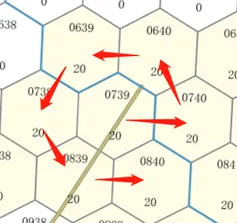

地图邻域数据保存顺序

### **`Map.is_valid(pos) -> bool`**

**功能：**判断坐标是否在地图范围内

**参数说明：**
|参数名|	数据类型|	说明|
|---|---|---|
|pos|	int|	指定位置坐标|
**返回值：**bool, 1-合法，0-不合法
|返回值名|	数据类型|	说明|
|---|---|---|
|valid|	bool|	是否合法|
### **`Map.get_grid_distance(center, distance_start, distance_end) -> set`**

**功能：**计算距离圆心，距离在distance\_start和distance\_end之间的所有六角格的坐标

**参数说明：**
|参数名|	数据类型|	说明|
|---|---|---|
|center|	int|	圆心|
|distance_start|	int|	距离起点|
|distance_end|	int|	距离终点|
**返回值：**
|返回值名|	数据类型|	说明|
|---|---|---|
|grid|	set|	符合条件的所有六角格坐标的set|


## **地图数据**

地图数据总共由三部分组成，`basic.json`是基础地图数据，`cost.pickle`为机动成本数据，`see.npz`为通视数据。环境和agent均需要这些数据完成初始化。在`ai/map.py`中有为AI开发便利而开放的地图数据接口，使agent方能够得到一局推演中的地图数据。agent开发者可通过开放接口来使用地图数据，也可以自行读取地图数据源文件，自行使用数据。

### **基础数据`basic.json`**

```json
{
    "ele_grade": "高程 int",
    "map_data": [
        [
            {
                "elev": "高程 int",
                "cond": "地形 int 0-开阔地 1-从林地 2-居民地 3-松软地 4-大河流 5-路障",
                "roads": "六个方向上道路类型 0-无 1-黑色 2-红色 3-黄色 list",
                "rivers": "六个方向上河流 0-无 1-有 list ",
                "neighbors": "六个方向上邻域坐标 list"
           }
        ]
    ]
}
```

### **通行代价`cost.pickle`**

三维`list`,存放不同通行模式下到邻域的通行代价

```json
[
    [
        [
            { "能通行的邻域坐标 int " : "通行代价 int" }
        ]
    ]
]
```

-   第一维索引: 通行方式, 取值范围\[0-车辆机动, 1-车辆行军, 2-步兵机动, 3-空中机动\]
-   第二维索引: 地图行坐标 取值范围\[0, max\_row)
-   第三维索引: 地图列坐标 取值范围\[0, max\_col)
-   元素: 到邻域的通行代价,通行代价定义为当前通行模式下最大机动速度/当前速度

### **通视数据`see.npz`**

储存预计算好的通视数据。五维数组，表示以某种模式的两点之间是否通视的`int`, `0`代表不同时，`1`代表通视。

```
[
    [
        [
            [
                [
                    "0 or 1"
                ]
            ]
        ]
    ]
]
```

-   第一维索引：
    -   0：地对地模式
    -   1：低空对低空模式
    -   2：低空对地模式
    -   3：超低空对地
    -   4：超低空对超低空
    -   5：低空对超低空
    -   6：高空对地
    -   7：高空对超低空
    -   8：高空对低空
    -   9：高空对高空
-   第二维索引：第一点的行坐标
-   第三维索引：第一点的列坐标
-   第四维索引：第二点的行坐标
-   第五维索引：第二点的列坐标


### 想定
#### 想定文件
想定文件是环境初始化时的必要文件，内部包含一个想定的所有初始条件。想定文件直接决定一场推演的初始态势。开发者可以自行修改想定文件的内容，达到修改想定的目的。

以下为想定文件json中，最外层的数据格式和内容含义：
```json
{
    "operators": "此属性和态势中的'operators'完全一致",
    "time": {
        "cur_step": "初始步数，int",
        "max_time": "最大推演步数，int"
    },
    "cities": [
        {
            "coord": "位置，int",
            "value": "分值，int",
            "flag": "占领状态，-1-未占领，0-红方占领，1-蓝方占领",
            "name": "主要夺控点，次要夺控点"
        }
    ],
    "landmarks": {
        "roadblocks": ["路障位置，int"],
        "minefields": ["雷场位置，int"]
    },
    "blueprints": ["如果此想定会用到导演增加算子动作，需要在此处添加要增加的算子数据"],
    "config": {
        "electronic_jamming_config": {
            "global_jam_switch": "bool, 是否开启全局干扰规则",
        },
        "fire_support_config": {
            "red_X_switch": "bool，红方x火力支援开关",
            "red_X_num": "int，红方x火力次数",
            "red_X_wait": "int，红方x火力延迟",
            "red_X_duration": "int，红方x火力持续时间",
            "red_Y_switch": "bool，红方y火力支援开关",
            "red_Y_num": "int，红方y火力支援次数",
            "red_Y_wait": "int，红方y火力支援延迟时间",
            "red_Y_duration": "int，红方y火力支援持续时间",
            "blue_X_switch": "bool，蓝方x火力支援开关",
            "blue_X_num": "int，蓝方x火力支援次数",
            "blue_X_wait": "int，蓝方x火力支援延迟时间",
            "blue_X_duration": "int，蓝方x火力支援持续时间",
            "blue_Y_switch": "bool，蓝方y火力支援开关",
            "blue_Y_num": "int，蓝方y火力支援次数",
            "blue_Y_wait": "int，蓝方y火力支援延迟时间",
            "blue_Y_duration": "int，蓝方y火力支援持续时间"
        },
        "launch_mission_config": {
            "launch_mission_deadline": "int，发射任务最后期限",
            "undisguised_launch_point_reduction": "int，未伪装的发射任务的分数惩罚",
            "warhead_num": "int，弹头数量",
            "mission_score": "int，发射任务分",
            "exposure_consecutive_min_time_lv1": "int，一级暴露触发惩罚最小连续时间",
            "exposure_consecutive_min_time_lv2": "int，二级暴露触发惩罚最小连续时间",
            "exposure_consecutive_min_time_lv3": "int，三级暴露触发惩罚最小连续时间",
            "exposure_score_deduction_lv2": "int，二级暴露分数惩罚",
            "exposure_score_deduction_lv3": "int，三级暴露分数惩罚"
        },
        "satellite_support_switch_red": "bool，卫星凌空规则开关",
        "satellite_support_switch_blue": "bool，卫星凌空规则开关",
        "satellite_support_delay_time_red": "int，卫星凌空效果延迟时间",
        "satellite_support_delay_time_blue": "int，卫星凌空效果延迟时间",
        "satellite_support_duration_time_red": "int，卫星凌空效果持续时间",
        "satellite_support_duration_time_blue": "int，卫星凌空效果持续时间",
        "satellite_support_cooldown_time_red": "int，卫星凌空冷却时间",
        "satellite_support_cooldown_time_blue": "int，卫星凌空冷却时间"
    },
    "launch_sites": "此属性与态势中的'launch_sites'完全一致",
    "com_graph": "此属性与态势中的'com_graph'完全一致"
}
```

### 武器
武器ID与武器名称映射表（部分）：
|武器名称|	武器id|
|--|--|
|便携导弹|	71|
|便携导弹（对地）|	5|
|步兵轻武器|	29|
|车载导弹|	69|
|车载轻武器|	43|
|大号直瞄炮|	36|
|火箭筒|	35|
|速射炮|	56|
|速射炮（对地）|	4|
|炮射导弹|	84|
|轻型炮|	89|
|小号直瞄炮|	54|
|小型导弹|	75|
|巡飞导弹|	76|
|中号直瞄炮|	37|
|中型导弹（标准）|	83|
|中型导弹（便携）|	74|
|中型炮|	88|
|重型导弹|	73|
|重型炮|	72|
|防空高炮|	1|
|便携防空导弹|	2|
|车载防空导弹|	3|

## 规则
### **兵棋要素**

#### **地图和地形量化**

##### **高程**

高程代表所在位置的相对地图中最低点的相对高度，在六角格上用颜色和数字标识，颜色越深高度越高，数字则对应具体的高程值。

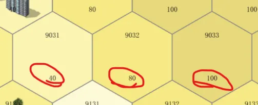

高程是陆战兵棋地形的重要属性，影响算子的机动、观察以及对火力打击产生影响：

-   机动：相邻两六角格，高差越大，所需机动值越多，机动速度越慢；
-   观察：地形的高低会产生对观察视野的遮挡，从而高地往往具有更开阔的视野，而低洼地带能够产生隐蔽的效果；
-   射击：通常来说从高处打低处会取得更好的对敌毁伤效果，反之则削弱对敌的毁伤。

##### **地物**

地物是某区域地表的包括特殊地形特征，包括：居民地，从林地，水域，松软地，公路、铁路等等
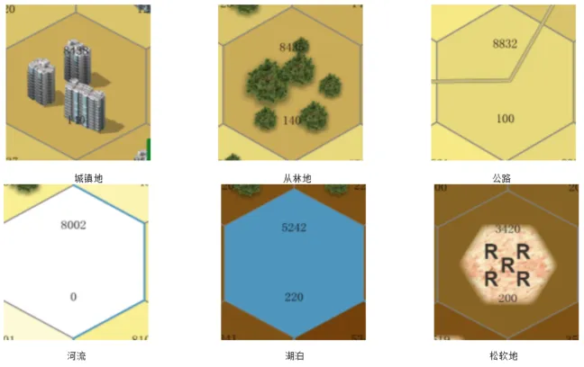

地物特殊地形会对算子动作造成一定的影响，比如降低通行速度，改变被观察距离，降低打击效果等。 通常当车辆进入居民地、丛林地、松软地及水域机动速度将减缓，但当车辆是沿公路或铁路机动时，则不受高程、从林地、松软地等特殊地形对机动速度的影响； 车辆“行军”动作必须沿着公路线或铁路线才能实施（行军速度可达到普通机动速度的2倍）。

##### **设施**

设施是为了达到对抗目的在某区域人工设置的条件，包括路障、间瞄炮火区、雷场等等
- 路障和间瞄炮火区
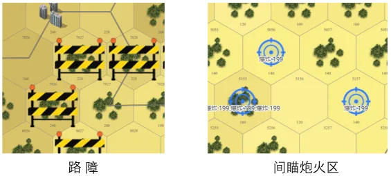
- 雷场
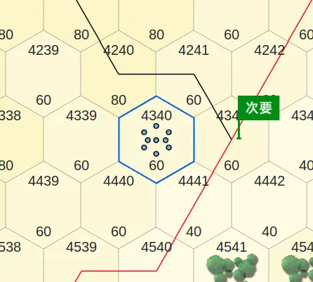
- 发射阵地
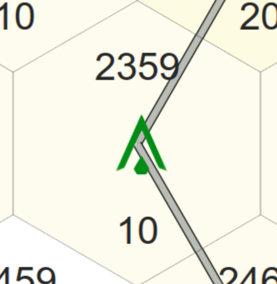
- 通信节点
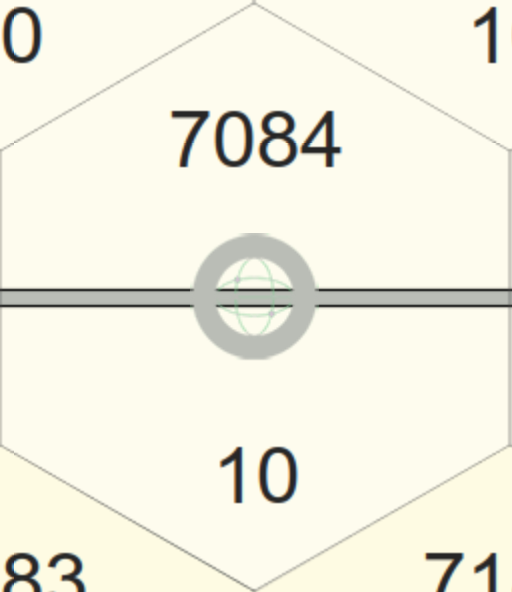
-   路障：阻碍地面算子机动，地面算子（人员/车辆）无法通过设置有路障的区域。
-   间瞄炮火区：为间瞄炮兵算子下达间瞄火力且炮火到达的区域。地面算子进出炮火区将受到间瞄火力裁决，详见[间瞄射击规则](https://wargame.ia.ac.cn/docs/rules/rules/#jianmiaoguize)和[间瞄射击裁决表](https://wargame.ia.ac.cn/docs/rules/tables/#jianmiaobiao)
-   雷场：没有扫雷开辟通路功能的算子，也没有半速沿已开通路机动的算子，进入雷场后会受到雷场裁决，详见[雷场裁决表](https://wargame.ia.ac.cn/docs/rules/tables/#leichangbiao)
-   发射阵地：发射车可以执行发射任务的地点
-   通信节点：指挥车和通信车进行通信需要所处的位置

#### **算子的表示**

陆地指挥官兵棋中一个算子代表一个排的聚合兵力，例如一个坦克排，可以由1~4辆坦克构成。 算子有模型图标和棋子图标两种形式，在算子图标上标注有信息，指示了一个算子的防御力（装甲类型）、血量（班组数），以及武器的状态等，如图。

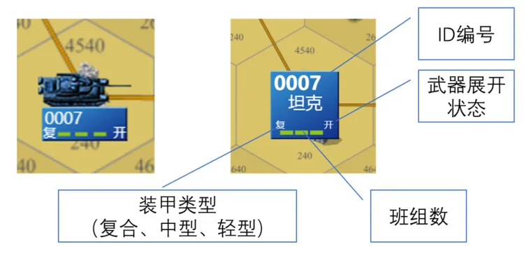

### 推演流程
陆地指挥官兵棋推演平台使用实时制的推演推进方式。即红蓝双方同时连续观察，连续下达推演操作指令。 推演引擎同时接收红蓝双方的指令，按照先到先裁的原则进行指令的裁决。 推演流程如下图所示：
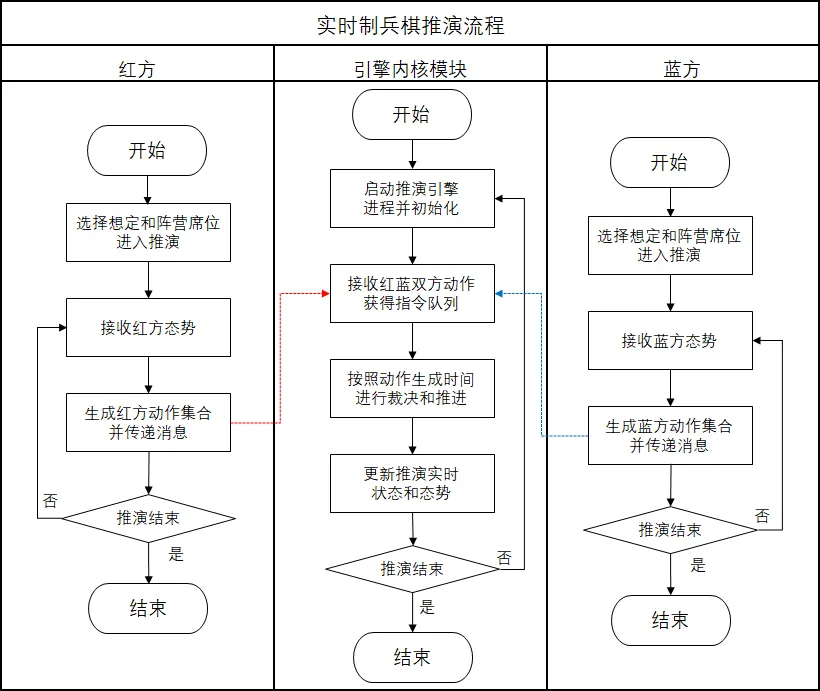
### 推演规则

#### 机动规则

1.  当棋子从一个六角格中心点机动至下一个相临六角格的中心点时，视为机动1格，以当前机动方式和下一个六角格的地形条件作为计算机动速度的依据。
2.  以棋子到达目标格的中心点作为后续机动或其他行动裁决的基准点，当棋子离开一个六角格的中心点后，在机动小于1格时射击或被射击等均以上一个六角格为裁决依据。
3.  机动指令一旦下达就不可更改，可以下达停止机动指令，停止机动指令下达后，当前机动指令未执行的部分不再执行，进入机动转停止阶段。
4.  机动状态有以下五种：正常机动，一级冲锋，二级冲锋，掩蔽，半速。以上状态之间互斥，算子在某一时刻只能处于一种状态之下。

#### 机动停止

1.  地面棋子转换为停止状态需要75秒的“机动→停止”转换时间，空中棋子转为悬停状态需要75秒的“机动→悬停”转换时间。
2.  必须等待“机动→停止”转换完成后才能执行的命令有：车辆武器锁定、车辆武器展开、上下车、发射巡飞弹、步兵或战车直瞄/间瞄/引导射击、空中单位直瞄/间瞄/引导射击，等其他必须在静止状态下才能执行的动作。
3.  可以对机动中的棋子下达停止机动命令，收到停止机动命令后，棋子必须完成当前格的机动后，才能停止，棋子停止后即开始“机动→停止”转换。停止机动命令会导致75秒的惩罚性“机动→停止”转换，在这期间不能进行任何操作。
4.  地面算子在机动转停止过程中，可以进行改变机动状态（模式）的动作；包括切换至：正常机动，行军，一级冲锋，二级冲锋，掩蔽，半速；

#### 车辆机动

1.  车辆在丛林地机动速度为正常速度的二分之一，居民地机动速度为正常速度的三分之一，小河流机动速度为正常速度的二分之一，大河流机动速度为正常速度的四分之一，松软地机动速度为正常速度的四分之一。
2.  地图的单位高程差表示六角格高度的最小变化值，一般分为5米，10米，20米
3.  地图的坡度等级是：两个六角格之间的高程差除以地图的单位高程差。一般分为1级坡度，2级坡度，3级坡度，4级坡度，5级坡度。1级坡度表示两个六角个之间的高程差等于1个单位高度差；2级坡度表示两个六角格之间的高程差等于2个单位高度差；3级坡度表示两个六角格之间的高度差等于3格单位高程差；依此类推。
4.  当车辆沿1级坡度地形机动时，按正常机动速度机动；当车辆在2级坡度地形机动时，按正常机动速度的1/2机动；当车辆在3级坡度地形机动时，按正常机动速度的1/3机动；依次类推；当坡度等级>5时，车辆无法进入并通过。
5.  当车辆沿道路以机动状态行驶时，速度不受地形和高差的影响。
6.  炮兵不能机动
7.  路障地形不可通过

#### 车辆行军

1.  车辆在行军方式速度为乡村路（黑色线）40千米/小时，一般公路（红色线）60千米/小时，等级公路（黄色线）90千米/小时。
2.  车辆必需进入道路六角格后才可转换为行军状态，转换过程需要75秒等待时间；只能沿道路走向规划行军路线，行军状态下速度不受地形和高差的影响。
3.  车辆行军前需要先将武器锁定（75秒时间）。
4.  如下一格存在停止的棋子或者非行军的棋子，则行军被阻挡
5.  行军状态下，棋子不能射击，不能引导射击，不能上下车，不能发射巡飞弹，不能离开道路。
6.  车辆由机动状态转为行军状态，或者由行军状态转为停止行军均需要75秒时间。

#### 人员机动

1.  人员机动速度不受地形影响。
2.  当高差＞60米时，人员速度降为正常机动速度的一半。
3.  人员可以切换到一级冲锋状态或二级冲锋状态：
    1.  一级冲锋：人员速度提高为原来的2倍，每冲锋1格增加一级疲劳。
    2.  二级冲锋：人员速度提高为原来的4倍，每冲锋1格增加一级疲劳。
    3.  一级疲劳状态下不能实施二级冲锋，二级疲劳状态下不能机动。
    4.  人员机动结束后，如果不继续机动，每75秒疲劳等级下降一级。
4.  人员机动或冲锋过程中如果遭到压制，立即转为被压制状态，在完成当前格的机动后自动停止，直到秒后压制自动解除后才能继续执行未完成的机动或冲锋命令。
5.  人员转为冲锋状态后，只要不转为正常机动状态，就始终处于冲锋状态。
6.  路障地形可以通过

### 上下车规则

1.  上车单位与车辆位于同一格，且上车单位与车辆均处于停止状态，可执行上下车命令。
2.  上下车均需要75秒时间，在此过程中不可执行其它命令，也不可取消上下车命令。
3.  上车单位或车辆在开始上下车之前处于被压制状态下，不能开始上下车。
4.  如果已经处于上⻋状态，上车单位被压制会立即停⽌上⻋，⻋辆被压制会立即停⽌上⻋
5.  如果已经处于下⻋状态，⻋辆被压制会立即停⽌下⻋

### 掩蔽规则

1.  棋子转换为掩蔽状态需要75秒等待时间，在此过程中棋子不能执行其它命令。
2.  棋子在转换为掩蔽状态过程中，如果坦克射击会立刻中断掩蔽转换过程。
3.  棋子转为掩蔽状态后如果机动或射击则自动解除掩蔽状态，不需要消耗时间
4.  引导算子进行引导射击，不会退出掩蔽；被引导算子进行引导射击仍会解除掩蔽状态。
5.  如果先处于压制状态，棋子不可以执⾏掩蔽命令
6.  在转掩蔽过程中，棋子被压制会打断掩蔽命令
7.  先处于掩蔽状态中，棋子被压制不会结束掩蔽状态
8.  掩蔽，正常机动，一级冲锋，二级冲锋，半速状态之间互斥，算子在某一时刻只能处于一种状态下。

### 堆叠规则

1.  在同一个六角格内，不可堆叠超过4个本方地面单位。如果六角格内已存在4个本方地面单位，则格外本方地面单位不能再进入或通过该六角格。

### 夺控规则

1.  棋子只要机动（或行军）到夺控点中心，并且夺控点所在格及与其相临的6个六角格内无敌方地面单位，即可执行夺控命令。
2.  夺控无等待时间、也无需等待机动停止转换结束。
3.  空中单位和炮兵不能执行夺控命令。
4.  棋子在执行其它命令中和被压制时也可以夺控。

### 通视规则

1.  通视是判断两点之间是否有更高高程的遮挡物，以六角格为单位计算，使用六角格中心点到另一个六角格中心点之间连线判断是否通视。通视计算时，如果两个棋子高程不同，则遵循高看低原则，两个棋子高程高者为观察点，高程低者为目标点，位于高高程的棋子在所在六角格高程的基础上再加1个高程等级进行通视计算。
2.  通视计算时，连线高程定义为两个端点高程的线性插值，连线高程被更高高程的六角格（连线经过的居民地、丛林地六角格高程加1，两个端点所在六角格内的居民地、丛林地高程不被修正,但遵循高看低原则观察点的高程加1）所阻挡，则不通视。
3.  系统根据上述规则自动判断，通视的目标如果出现在观察单位的观察范围之内，会自动显示在态势中。根据上述规则，相邻六角格总是通视。
4.  手动判断方式：在交互界面上从六角格中心点到另一个六角格中心点之间连线，跳出的菜单中显示是否通视，连线间阻挡视线的更高高程六角格用红叉显示在界面上。

### 观察规则

通视、无地形遮蔽条件下棋子相互可观察的距离（格数）

| 观察棋子 \\ 被观察棋子 | 步兵 | 车辆 | 直升机  | 无人机/巡飞弹 |
|---------------|-----|-----|------|---------|
|      **步兵**       | 10 | 25 |  25  | 当前/相邻格  |
|      **车辆**       | 10 | 25 |  25  | 当前/相邻格  |
|      **直升机**      | 10 | 25 |  25  | 当前/相邻格  |
|    **无人机/巡飞弹**    | 2  | 2  | 不可观察 |  不可观察   |

1.  棋子掩蔽状态下，被观察距离减半。
2.  当车辆棋子高程低于观察者高程时，掩蔽对观察无效。
3.  棋子位于通视的居民地、从林地六角格内，被观察距离减半。

### 直瞄射击规则

#### 武器锁定

1.  初始态势所有车辆算子的武器均为展开状态。
2.  车辆行军前需要先锁定武器，才能切换至行军状态。
3.  武器锁定过程中，不能同时执行其它命令。

#### 武器展开

1.  车辆棋子在行军后、射击前需要展开武器，展开时间为75秒，武器展开后行动不需要再次展开。
2.  武器展开过程中，不能同时执行其它命令。

#### 行进间射击

1.  坦克主炮（大号、中号直瞄炮）具有行进间射击能力，可以在机动中射击。
2.  坦克在机动转停止、转掩蔽的过程中可以射击，转行军的过程中不能射击。
3.  无行进间射击能力的棋子转掩蔽、转行军的过程中均不能射击或引导射击。
4.  坦克由停止状态转换掩蔽状态的过程中可射击，射击后当前掩蔽命令取消。

#### 武器冷却

1.  直瞄武器射击完毕后，需要75秒的冷却时间，冷却完成后才能继续射击。
2.  棋子武器冷却时，可同时执行机动、掩蔽等命令，武器冷却不受影响。

#### 射击条件

1.  目标被射击者观察到且目标位于当前武器射程内。
2.  棋子武器已展开、射击过的武器已冷却结束。
3.  地面棋子处于停止状态（坦克主炮除外），空中棋子处于悬停状态。

#### 战果表示

1.  战果为数字表示消灭了对方几个班（或几辆车），同时对车辆单位造成压制。
2.  无效，表示未对对方造成损失。
3.  压制，表示未消灭对方有生力量，但造成了对目标的压制。

#### 直瞄射击战果修正

1.  射击单位处于机动中、被压制状态，战果作不利修正。
2.  目标单位处于掩蔽地形、机动中，战果作不利修正。
3.  目标单位处于堆叠状态、行军状态，战果作有利修正。

#### 战果影响

1.  车辆被压制后人员不能上、下车，人员被压制后不能机动和射击。
2.  被压制的步兵棋子再次被裁决压制，损失1个班，剩余的班仍保持被压制状态。
3.  车辆棋子损失几辆车，车内步兵棋子也相应损失几个班。
4.  车辆被压制，车内人员不会被压制，但不能下车。
5.  压制状态持续秒后自动移除。

### 间瞄射击

#### 间瞄计划

1.  间瞄射击特指炮兵棋子的射击。
2.  间瞄射击需先进行间瞄计划，计划点标记后等待秒飞行阶段之后进行间瞄裁决，爆炸阶段持续秒，在此期间进入该格的棋子需受到一次间瞄裁决。
3.  间瞄计划的冷却时间为秒，
4.  正在飞行，未裁决的间瞄计划可以取消，间瞄计划的冷却时间清零
5.  间瞄冷却时间结束时可立刻进行下一次间瞄计划。
6.  由于计划的冷却时间为秒，而间瞄点存在时间最长为s+s，因此有可能出现同一炮兵同一时间具有2个间瞄点，一个在爆炸一个在飞行。

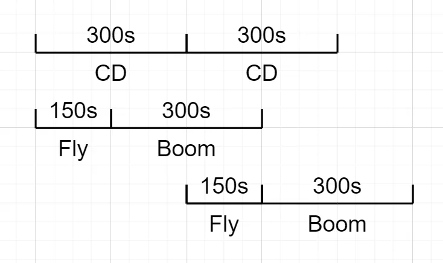

#### 间瞄校射

1.  间瞄裁决时，如果有本方校射单位正在观察间瞄计划格或格内的目标，则裁决为有校射，否则按无校射裁决。
2.  校射单位包括本方所有地面单位和无人机，直升机和巡飞弹不能提供校射。
3.  校射观察的距离需遵守观察规则。
4.  无校射：间瞄裁决时本方没有单位能观察到目标格（不通视）。
5.  格内校射：间瞄裁决时本方有单位能观察到目标格，但观察不到格内目标（最远观察距离通视但不能观察）。
6.  目标校射：间瞄裁决时本方有单位能观察到目标格和格内目标（通视、能观察）。

#### 间瞄裁决

1.  间瞄裁决后，会对经过爆炸区域的棋子产生持续性伤害，持续时间为秒。
2.  如果在裁决的秒之间炮兵机动，则立刻取消间瞄裁决点
3.  间瞄裁决不仅对敌方，对已方也会造成伤害。
4.  命中：表示炮火准确命中目标格及格内目标。
5.  散布：表示炮火命中目标格，但没有命中格内目标。
6.  散布n格：表示炮火实际命中格距离计划格n格。

#### 间瞄射击战果修正

1.  目标单位处于掩蔽地形、掩蔽状态、未机动，裁决结果作有利于目标单位的修正。
2.  目标单位处于堆叠状态、机动或行军状态，裁决结果作不利于目标单位的修正。

### 巡飞弹规则

1.  巡飞弹飞行速度为8秒/格，飞行高度为所在格高程基础上增加200米。
2.  巡飞弹对暴露的地面目标的侦察距离为2格，按照通视规则对目标进行侦察，车辆目标处于掩蔽状态，巡飞弹对其侦察距离不受影响，人员目标处于掩蔽状态，巡飞弹对其侦察距离减半。
3.  巡飞弹棋子由所属车辆发射，对抗开始后才能发射巡飞弹。
4.  巡飞弹部署及发射均需75秒时间，战车棋子一次只能发射一枚巡飞弹。
5.  巡飞弹飞行过程中，发射车可以正常行动，包括机动与射击，但不能发射其它巡飞弹。
6.  巡飞弹发现打击目标后马上可以进行打击，无需飞完全部机动路线。
7.  巡飞弹的巡飞时长为0秒，超时则自毁。发射后的巡飞弹如遇发射车被摧毁，则巡飞弹自毁。
8.  如果巡飞弹的所属车辆被击毁，巡飞弹也会被击毁

### 无人机规则

1.  无人机飞行速度为8秒/格，飞行高度为所在格高程基础上增加200米。
2.  无人机对暴露的地面目标的侦察距离为2格，按照通视规则对目标进行侦察，车辆目标处于掩蔽状态，无人机对其侦察距离不受影响，人员目标处于掩蔽状态，无人机对其侦察距离减半。地面单位对无人机的观察距离为相邻格。

### 武装直升机规则

1.  直升机飞行速度为4秒/格，飞行高度为所在格高程基础上增加200米。
2.  武装直升机对暴露的人员目标的观察距离为10格，对暴露的车辆目标的观察距离为25格，按照通视规则对目标进行侦察，车辆目标处于掩蔽状态，武装直升机对其侦察距离不受影响，人员目标处于掩蔽状态，武装直升机对其侦察距离减半。
3.  武装直升机对无人机、巡飞弹的观察距离为当前格和相临格，地面单位对武装直升机的观察距离为25格，武装直升机相互间的观察距离为25格。

### 无人战车规则

1.  无人战车棋子的机动、侦察、直瞄射击规则同战车规则。
2.  无人战车需依托有人战车为载体，无人站车必须与一辆有人战车有隶属关系
3.  无人战车下车后，在停止状态下可在具备引导射击条件时，引导所属有人战车进行射击。
4.  无人战车所属有人战车如被摧毁，则无人战车一同被歼灭

### 引导射击规则

1.  引导射击可由步兵，无人战车、无人机实施。引导射击条件：
    1.  引导算子必须观察到拟攻击目标
    2.  拟攻击目标在被引导算子（重型战车）的可被引导武器的射程范围内（可不通视）
2.  步兵，无人战车只能对所隶属车辆的重型导弹进行引导，无人机可对本方所有装备了重型导弹的车辆单位进行引导，无人机一次只能引导一个单位进行射击。
3.  战车被引导射击时，自身需处于武器已展开、武器已冷却、未机动、未正在执行其它命令状态。
4.  步兵，无人车在机动状态、被压制状态、正在执行其它命令状态、武器未展开、未冷却结束等状态下不能引导射击。无人机必须在悬停状态下才可以引导射击。
5.  只有战车的重型导弹支持被引导射击，其它武器均不支持被引导射击。
6.  实施引导射击后，引导算子和被引导算子，均需要75秒的准备时间才能再次进行引导或使用自带的武器进行直瞄射击。

### 同格交战规则

1.  当同一六角格内存在双方地面算子时，触发同格交战规则，格内地面算子处于同格交战状态，自动按距离为0格进行直瞄射击裁决；将自动选择攻击等级最高的武器进行打击，裁决顺序按照先进入该六角格的算子先实施打击；其打击目标的选择按照“坦克”>“战车”>“其他车辆”>“人员”的优先顺序自动选择；当存在同类型多个目标时，优先选择班组数少的算子进行打击（同类目标班组数相同则随机选择）。
2.  同格交战会每间隔25秒自动进行一次直瞄射击；进入同格交战状态的第一瞬间会立刻进行一次直瞄射击切不受武器冷却时间、机动状态和压制状态的限制，但武器未展开的算子（行军中）、未下车的人员不得实施射击。在进入同格交战状态前存在的武器冷却状态会取消，被同格交战的直瞄射击造成的冷却状态替代
3.  当同格交战发生时，处于格外的算子不能对处于同格交战状态的算子进行直瞄射击；处于同格交战状态的算子依然会受到间瞄火力的打击。
4.  处于同格交战状态的算子只能接受机动指令，用于脱离同格状态，但是下达机动会受到处于同一格内的所有敌方算子的一次惩罚性打击；
5.  同格交战状态会中断“上下车”，“转隐蔽”，“武器展开和锁定”的转换过程，但不会影响算子已经进入的状态如：机动、行军、掩蔽、压制、堆叠等。
6.  同格交战状态的解除：当前无敌我双方算子处于同六角格格。可能的情况包含：处于同格交战状态的一方算子机动离开同格交战所在六角格；或同格中的一方算子被全部歼灭。同格交战状态解除时，正在进行中的武器冷却状态会继续存在，直到正常倒计时结束。
7.  在使用步兵轻武器对车辆单位实施打击时，攻击等级见《步兵轻武器对车辆攻击等级表》，战斗结果见《直瞄武器对人员/步兵轻武器对车辆战斗结果表》，战果修正见《车辆战损结果修正》。

### 运输直升机规则

1.  直升机飞行速度为4秒/格，滞空状态分为高空”、“低空”、“超低空”三种空中状态
2.  三种状态分别按照所在六角格的高程上增加500米、200米、20米计算通视，不同高度状态下射击战果和遭受打击战损修正不同
3.  超低空状态下机动速度减半
4.  直升机可通过“切换高度”指令实现在相邻的两个高度状态之间切换，切换高度消耗时间75秒。
5.  步兵单位可乘坐运输直升机快速机动。直升机以悬空索降“装载”和“卸载”人员单位，装卸载过程消耗75秒时间。装载与卸载必须在开阔地实施；直升机处于“超低空”状态；人员与直升机均为“停止”、非“压制”等（同上下车）
6.  搭载的步兵单位班数需小于或等于直升机的承载单位数，如步兵班数大于承载单位数，可通过“解聚”操作，实现分组降班，再行搭乘；运输直升机“装载”时必须处于“空载”状态（即机上无人员单位，如装载有人员单位，需先将人员卸载，再将人员编组后执行装载）
7.  运输直升机同时只能执行“装载”或“卸载”一种动作；装卸载过程中不能执行射击、掩蔽、机动等其他动作。
8.  直升机在处于超低空状态，装卸载时及飞行过程中可遭受炮兵火力打击，并作为整体接受毁伤裁决。出现战损，直升机和装载单位同等损失；直升机装卸载过程中遭受直瞄或间瞄射击被压制，装卸载失败，须等待压制效果移除后重新装卸载。

### 聚合解聚规则

1.  为便于推演人员灵活使用兵力，增加地面算子“聚合”、“解聚”规则，允许推演人员对算子进行聚合（整编兵力）解聚（区分兵力）操作。
2.  处于相同六角格内的两个（只能两个算子之间聚合，可通过多轮聚合实现三个及以上算子的兵力整编）同类型算子可进行“聚合”操作。聚合的算子须处于静止、未射击等行动状态（包括乘车、乘机、被压制等），且聚合后的总班数不得大于4。下达聚合指令后，经过75秒，算子完成聚合，生成一个新算子（车班数为累加值）。
3.  算子解聚时，该算子必须处于静止、未射击等行动状态（包括上下车、被压制等）。下达解聚指令后，经过75秒完成解聚，由算子生成两个新算子，解聚模式为：+=，+1。
4.  在聚合解聚过程中，执行操作的算子遭受射击被压制、进入同格交战状态等，聚合解聚失败。正在聚合与解聚过程中的算子不可执行射击、机动、掩蔽、夺控等操作。
5.  战车发射巡飞弹后，巡飞弹在空中存活时，该战车不可进行聚合解聚动作。
6.  战车上有搭载乘员时，乘员和战车分别进行聚合解聚。动作结束之后分别根据规则确定乘员和战车的车班数，并原有保持状态。
7.  解聚后，两个生成的算子的弹药数与原算子保持不变。聚合之后，合成的算子的弹药数按照两个算子的弹药数的平均数向下取整。其他算子属性，除车班数外，均保持不变
8.  战前部署阶段允许地面算子执行聚合解聚。
9.  炮兵暂不支持聚合解聚

### 特别防空算子规则

1.  专业防空武器暂以独立作战的近程防空武器系统为主设计
2.  车辆单位“防空高炮”：对空直瞄射程设定4公里（20格），每次射击间隔15秒，每辆车最多射击10次。防空高炮的防护可设定为中型、轻型两类，遭打击毁伤裁决时可进行相应修正。
3.  人员单位“防空导弹小队”：对空射程4公里（20格），每次射击间隔75秒，每个班最多射击4次（弹药数量4枚）。
4.  车辆算子“防空导弹车”：射程10公里（50格），每次射击间隔15秒，每辆车最多射击4次。遭打击按车辆单位裁决，防护可设定为重型、中型、轻型三类。
5.  “防空导弹小队”和“防空导弹车”自带雷达，可观察到50格内范围的空中目标，对无人机观察距离减半（25格），不能观察到巡飞弹
6.  防空算子1次动作可能产生大于1次的裁决，裁决次数和算子当前车班数相等，1辆车打击1次产生1此裁决，n辆车打击1次产生n次裁决。
7.  防空高炮1车可攻击10次，导弹排1班可攻击4次，导弹车1车可攻击4次

通视、无地形遮蔽条件下棋子相互可观察的距离（格数）

| **观察算子\\被观察算子** | **步兵** | **车辆** | **直升机/运输机** |  **无人机**   |  **巡飞弹**   |
|-------------|-----|-----|---------|--------|--------|
|     **步兵**      | 10 | 25 |   25    | 当前/相邻格 | 当前/相邻格 |
|     **车辆**      | 10 | 25 |   25    | 当前/相邻格 | 当前/相邻格 |
|   **直升机/运输机**   | 10 | 25 |   25    | 当前/相邻格 | 当前/相邻格 |
|     **无人机**     | 2  | 2  |  不可观察   |  不可观察  |  不可观察  |
|     **巡飞弹**     | 2  | 2  |  不可观察   |  不可观察  |  不可观察  |
|    **侦察型战车**    | 20 | 50 |   25    | 当前/相邻格 | 当前/相邻格 |
|   **防空导弹小队**    | 10 | 25 |   50    |   25   |  不可观察  |
|    **防空导弹车**    | 10 | 25 |   50    |   25   |  不可观察  |

### 侦察与校射规则

1.  增加专业侦察力量和装备。
2.  “侦察型战车”，对地面单位侦察距离最大为50格，
3.  “炮兵校射雷达”，属车辆单位。开机工作后，已方炮火统一按照格内校射进行散布裁决。
4.  雷达车处于静止、未被压制状态下，可下达“开启雷达”指令，经75秒后雷达车处于开机状态。雷达在开机过程中遭直瞄或间瞄射击产生压制战果时开机过程中断。
5.  雷达开机工作期间可以执行“机动”指令，下达机动指令后，开机状态立即停止，尔后按机动规则实施机动。需通过“开启雷达”指令重新经75秒重新进入雷达开启状态。
6.  当雷达车处于雷达开启状态时被裁决压制，雷达开启效果失效，压制状态结束后雷达开启效果自动恢复，无需再次下达指令重复开启雷达。

### 工事规则

1.  现有工事类型为永久性工事。
2.  工事的基本作用是为进入工事的人员或车辆提供隐蔽和防护。
3.  工事区分为人员工事（战斗工事，隐蔽工事）和车辆工事两类，人员和车辆单位只能进入相应类型的工事（载人车辆按车辆处理，进入车辆工事。
4.  每个六角格只能设定一个工事，每个工事可容纳的人/车班数为5。
5.  当裁决结果导致工事内的人员或车辆车班数大于工事剩余容量时，工事内部所有单位瞬时退出工事，视同人员或车辆失去工事保护，按暴露状态进行观察和被射击裁决。

#### 车辆工事

1.  工事本身具有一定的隐蔽效果，双方算子只可对12格内的对方工事进行观察和直瞄间瞄射击。工事所在六角格，如处于居民地、丛林地等，其地形属性对工事在被观察、被射击时的影响同样存在，需进行相应修正。
2.  车辆进入相应工事所在格时，推演人员下达“进入工事”指令，等待75秒完成进入。如进入工事的车辆车班数大于工事剩余容量，进入失败。进入工事的单位不可被观察（全程隐蔽），但可进行直瞄射击（包括对地、对空射击）。下达“离开工事”指令，等待75秒车辆离开工事，停留在工事当前格，可被观察。
3.  处于被观察范围内的工事可被直瞄和间瞄射击，射击结果按对车辆射击结果进行裁决，并按结果裁定剩余工事容量。
4.  工事的防护可设定为重型（野战工事）、中型（简易工事）两类，遭射击时可进行射击结果修正。
5.  工事遭射击时，如内部为车辆单位，车辆不继承射击结果
6.  当裁决结果导致工事内的车辆车班数大于工事剩余容量时，工事内部所有单位瞬时退出工事，视同车辆失去工事保护，按暴露状态进行观察和被射击裁决。

#### 人员战斗工事

1.  工事本身具有一定的隐蔽效果，双方算子只可对12格内的对方工事进行观察和直瞄间瞄射击。工事所在六角格，如处于居民地、丛林地等，其地形属性对工事在被观察、被射击时的影响同样存在，需进行相应修正。
2.  人员进入相应工事所在格时，推演人员下达“进入工事”指令，等待75秒完成进入。如进入工事的人员车班数大于工事剩余容量，进入失败。进入工事的单位不可被观察（全程隐蔽），但可进行直瞄射击（包括对地、对空射击）。下达“离开工事”指令，等待75秒人员单位离开工事，停留在工事当前格，可被观察。
3.  处于被观察范围内的工事可被直瞄和间瞄射击，射击结果按对车辆射击结果进行裁决，并按结果裁定剩余工事容量。
4.  工事的防护可设定为重型（野战工事）、中型（简易工事）两类，遭射击时可进行射击结果修正。
5.  工事遭射击时，如内部为人员单位，人员直接继承射击结果。
6.  当裁决结果导致工事内的人员班数大于工事剩余容量时，工事内部所有单位瞬时退出工事，视同人员失去工事保护，按暴露状态进行观察和被射击裁决。

#### 人员隐蔽工事

1.  工事本身具有一定的隐蔽效果，双方算子只可对本格内的对方工事进行观察，工事不受所在六角格地形属性影响。
2.  人员进入相应工事所在格时，推演人员下达“进入工事”指令，等待75秒完成进入。如进入工事的人员车班数大于工事剩余容量，进入失败。进入工事的单位不可被观察（全程隐蔽），也不能进行直瞄射击（包括对地、对空射击）。下达“离开工事”指令，等待75秒人员单位离开工事，停留在工事当前格，可被观察。
3.  处于被观察范围内的工事不能被直瞄和间瞄射击。
4.  工事所在格里有敌方单位进入，守方立即暴露，自动离开工事，同时发起同格交战，先裁决守方；
5.  工事中无守方单位，不影响敌方单位夺取控制点

### 雷场规则

1.  增加防步兵坦克混合雷场，主要以临时抛撒布设，雷场观察距离为10格，遮蔽地形对雷场观察减半。
2.  允许在想定设计中预先设定雷场，在推演过程中，推演人员可使用“火箭布雷车”布设雷场。
3.  “火箭布雷车”可在50格内进行“布雷”作业，下达“布雷”指令后75秒完成1个雷场六角格的布设，一辆车最多可进行3次布雷。
4.  火箭布雷车布雷时，必须处于静止、未被压制状态下，在布雷75秒期间雷车机动或被压制，布雷均失败。
5.  雷场对敌我双方均有效，未开辟雷场通路进入雷场六角格，须进行毁伤裁决。
6.  推演人员可使用“扫雷车”或“坦克”，以半速通过雷场六角格，完成雷场通路开辟。
7.  雷场通路具有进出雷场的方向，同道路。
8.  一方开辟的雷场通路只能被己方可见并使用；
9.  人员单位沿雷场通路通过雷场或车辆单位以半速沿雷场通路通过雷场不进行雷场毁伤裁决。
10.  雷场裁决表见附录

### ~~支援算子规则~~

#### ~~天基侦察算子~~

1.  ~~天基侦察算子主要有侦察敌方兵力的作用。~~
2.  ~~算子不设分值，不可机动，不可攻击与被攻击。~~
3.  ~~当本方有天基侦察算子时，可侦察到敌方所有不在工事内的算子，不可见车班数，弹药数，战损状态；每个六角格内只显示编号最小的一个算子；~~
4.  ~~天基算子的观察到的算子不等于被算子直接观察到，不可直接发动直瞄打击。~~
5.  ~~天基算子无需激活。~~

### 电子干扰规则

#### 全局电子干扰

队长可以下达全局干扰指令，使得敌方的所有具备引导射击能力的算子（通常是无人机，无人车，步兵）暂时失去能力。

该效果一般持续75步，且在600步后可以再次实施全局干扰。

全局电子干扰可以影响一号车与营车之间的通信。

#### 局部电子干扰

局部电子干扰指的是电子干扰车或电子干扰小队对特定范围内实施电子干扰。

在电子干扰的作用范围内，敌方的无人单位（通常是无人车，无人机）无法接收到新的指令，但是正在执行的任务可继续执行（例如在干扰之前下达的机动动作）。

局部电子干扰需声明干扰的方向，随后干扰范围为该方向展开120°的扇形，对于干扰车延展距离为25格，对于干扰小队延展距离为5格。

电子干扰开启后最大持续75步，电子干扰的冷却时间为150步

实施干扰单位如果被摧毁，实施机动，或出现其他打断其干扰行动的事件，中断干扰状态，对敌方单位的干扰影响将立刻消失。

局部电子干扰可以影响一号车与营车之间的通信。

### 场外火力支援

场外火力支援相关规则模拟了场外因素对战场内的各类影响。 此类规则不涉及相关算子，以独立动作的形式存在于对抗中。 火力支援有资源限制，主要以使用次数的形式体现，且同阵营内共享资源。 火力支援相关动作不限制推演人员的权限，队长队员均可下达。

#### X火力支援

模拟重型炮对场内进行的**目标校射**间瞄火力打击。 一次推演内可使用12次。 选择火力打击点并下达指令后，火力将于100步之后到达，不可取消，对己方同样造成伤害。 火力在飞行过程中对敌方不可见，对己方可见。 火力到达后持续100步。

#### Y火力支援

模拟重型炮对场内进行的**无校射**间瞄火力打击。 一次推演内可使用12次。 选择火力打击点并下达指令后，火力将于100步之后到达，不可取消，对己方同样造成伤害。 火力在飞行过程中对敌方不可见，对己方可见。 火力到达后持续100步。

### **卫星支援规则**

卫星支援规则模拟卫星的临空侦察支援，其效果是：

-   侦察到敌方所有不在工事内的算子，不可见车班数，弹药数，战损状态
-   每个六角格内只显示编号最小的一个算子；
-   观察到的算子不等于被己方算子直接观察到，不可直接发动直瞄打击。

卫星凌空作为动作，作为阵营的共享资源，可被同一阵营的任一推演者实施，并共享其效果和冷却时间。

卫星凌空动作有以下时间参数，可通过对环境初始化配置改变：

-   效果延迟步长：指的是下达动作后，多长时间才可以得到卫星凌空的支援效果，默认值450步
-   效果持续时间：指的是卫星凌空支援效果的持续时间，默认值150步
-   动作冷却时间：指的是两次卫星凌空之间需要等待的冷却时间，默认值600步

当己方发起卫星侦查请求时，如果敌方如果配置了保障车，敌方将获得通知。

### 裁决表格

### **直瞄射击裁决表**

#### **对人员攻击等级表**
见docs/裁决表格.xlsx 对人员攻击等级表
#### **对车辆攻击等级表**

见docs/裁决表格.xlsx 对车辆攻击等级表
#### **步兵轻武器对车辆攻击等级表**
见docs/裁决表格.xlsx 步兵轻武器对车辆攻击等级表


#### **攻击等级高度差修正**
见docs/裁决表格.xlsx 攻击等级高度差修正


#### **对车辆单位战斗结果**
见docs/裁决表格.xlsx 对车辆单位战斗结果


#### **车辆战损结果修正**
> Info: 对车辆战斗结果修正时，修正方法是2颗骰子生成随机数，根据“射击算子状态修正”“目标所处地形修正”“目标状态修正”对随机数进行累计，尔后对照车辆的装甲级别查表确定最终修正结果。
见docs/裁决表格.xlsx 车辆战损结果修正

#### **直瞄武器对人员and步兵轻武器对车辆战斗结果表**
见docs/裁决表格.xlsx 直瞄武器对人员and步兵轻武器对车辆战斗结果表


#### **人员战损结果修正**
见docs/裁决表格.xlsx 人员战损结果修正


> Info:对人员战斗结果修正时，修正方法是1颗骰子生成随机数，根据“射击算子状态修正”“目标所处地形修正”“目标状态修正”对随机数进行累计，尔后查表确定最终修正结果。

### **间瞄射击裁决表**

#### **无校射火力散布裁决**
见docs/裁决表格.xlsx 无校射火力散布裁决
#### **格内校射火力散布裁决**
见docs/裁决表格.xlsx 格内校射火力散布裁决


#### **目标校射火力散布裁决**

| 随机数 | 2  | 3  | 4  | 5  | 6  | 7  | 8  | 9  | 10 | 11 | 12 |
|-----|-----|-----|-----|-----|-----|-----|-----|-----|-----|-----|-----|
| 结果  | 散布 | 散布 | 命中 | 命中 | 命中 | 命中 | 命中 | 命中 | 命中 | 散布 | 散布 |

#### **命中目标战斗结果**

| 随机数 | 轻型炮 | 中型炮 | 重型炮 |
|-----|-----|-----|-----|
|  2  |  2  |  3  |  3  |
|  3  |  1  |  2  |  2  |
|  4  |  1  |  1  |  2  |
|  5  |  1  |  1  |  1  |
|  6  | 压制  |  1  |  1  |
|  7  | 压制  | 压制  | 压制  |
|  8  | 压制  | 压制  |  1  |
|  9  | 压制  | 压制  | 压制  |
| 10  | 压制  |  2  |  2  |
| 11  |  1  |  1  |  1  |
| 12  |  1  |  1  |  2  |

#### **偏离目标战斗结果**

| 随机数 | 轻型炮 | 中型炮 | 重型炮 |
|-----|-----|-----|-----|
|  2  | 压制  |  1  |  1  |
|  3  | 压制  | 压制  |  1  |
|  4  | 压制  | 无效  | 压制  |
|  5  | 无效  | 无效  | 无效  |
|  6  | 无效  | 无效  | 压制  |
|  7  | 无效  | 压制  | 压制  |
|  8  | 无效  | 无效  | 无效  |
|  9  | 压制  | 无效  | 无效  |
| 10  | 无效  | 压制  | 压制  |
| 11  | 压制  | 压制  | 压制  |
| 12  | 压制  | 压制  |  1  |

#### **战斗结果修正**

> Info:间瞄射击结果的修正方法是先掷1颗骰子生成随机数，根据“**目标所处地形**”“**目标状态**”“**装甲防护**”“**火炮数量**”对先前的随机数进行累计加减，尔后查**修正结果**表确定最终修正结果。
见docs/裁决表格.xlsx 修正结果表

### **防空射击裁决表**

#### **武器攻击等级表**
见docs/裁决表格.xlsx 武器攻击等级表


#### **空战斗结果表**
见docs/裁决表格.xlsx 空战斗结果表

### **雷场裁决表**

#### **对车辆单位损伤结果表**

| 单位类型\\随机数 | 2 | 3 | 4 | 5 | 6 | 7 | 8 | 9 | 10 | 11 | 12 |
|-----------|-----|-----|-----|-----|-----|-----|-----|-----|-----|-----|-----|
|    车辆     | 0 | 0 | 0 | 0 | 1 | 1 | 0 | 0 | 0  | 2  | 1  |
|    人员     | 0 | 0 | 0 | 0 | 1 | 1 | 0 | 0 | 0  | 2  | 1  |

#### **对车辆单位损伤战斗结果修正表**

| 装甲类型\\随机数 |  2  |  3  |  4  |  5  | 6  | 7  | 8  | 9  | 10 | 11  | 12  |
|-----------|-----|-----|-----|-----|-----|-----|-----|-----|-----|-----|-----|
|   复合装甲    | \-2 | \-1 | \-1 | \-1 | \- | \- | \- | \- | \- | \-1 | \-1 |
|   重型装甲    | \-1 | \-1 | \-  | \-  | \- | \- | \- | \- | \- | \-  | \-1 |
|   中型装甲    | \-1 | \-  | \-  | \-  | \- | \- | \- | \- | \- | \-  | +1  |
|   轻型装甲    | +1  | \-  | \-  | \-  | \- | \- | \- | \- | \- | \-  | +1  |
|    无装甲    | +2  | +1  | \-  | \-  | \- | \- | \- | \- | \- | +1  | +1  |

#### **算子标准速度**

下表展示了各类算子在标准情况下，无高差，无特殊地形，无行军，无冲锋，无任何影响速度的因素下的速度。

|  算子种类   | 千米/小时 | 步/格 |
|---------|-------|-----|
|   坦克    |  36   | 20  |
|   战车    |  36   | 20  |
|   步兵    |   5   | 144 |
|   炮兵    |  36   | 20  |
|  无人战车   |  36   | 20  |
|   无人机   |  100  |  8  |
|  武装直升机  |  200  |  4  |
|   巡飞弹   |  100  |  8  |
|  运输直升机  |  200  |  4  |
|  侦察型战车  |  36   | 20  |
| 炮兵校射雷达车 |  36   | 20  |
|   布雷车   |  36   | 20  |
|   扫雷车   |  36   | 20  |
|  防空高炮   |  36   | 20  |
| 便携防空导弹排 |   5   | 144 |
| 车载防空导弹车 |  36   | 20  |
|   皮卡车   |  47   | 16  |